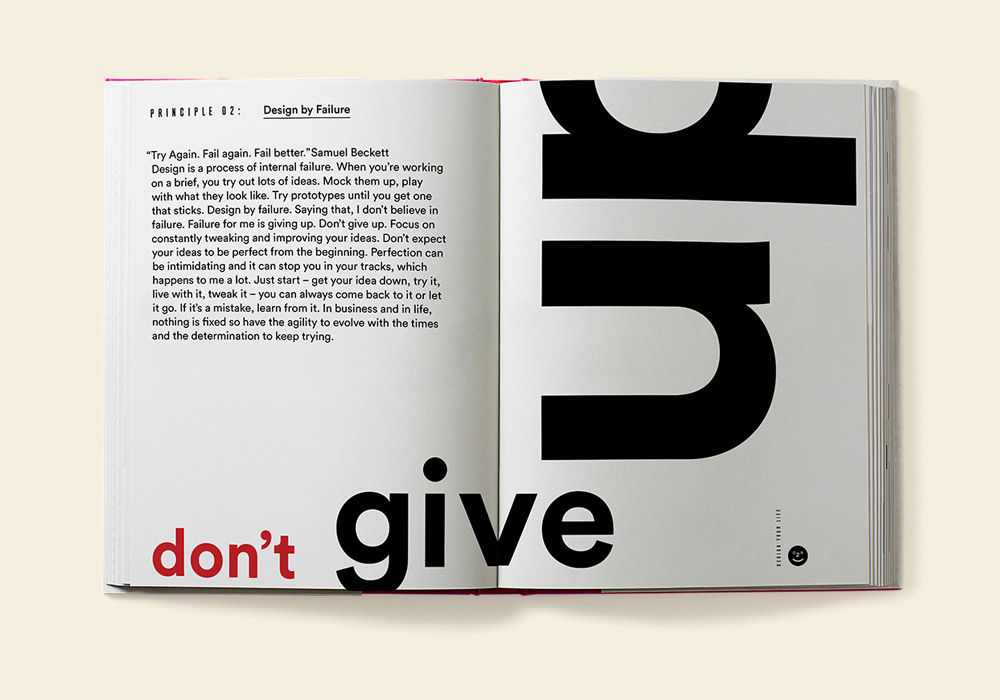

I'm really glad to be back on the course and I'm super excited to get started with GDE740 this week - I feel much more focused after taking a break. I also feel like I've learned a lot about myself and my practise 
while I've been gone - I've recently started to learn web development and coding, and I'm absolutely loving it. I've realised that I'm so fascinated in the intersection between design and tech, so I'd love to bring this into my work moving forward!

To start this module, we're starting a four week project that focuses on the theme of self-initited projects in graphic design. I've always found this theme interesting, as work and play can so easily become blurred when you do something creative that you're fundamentally passionate about for a living. 

I've always found it hard to find time to work on self initiated projects. It's frustrating as I wish I had more time to dedicate to personal projects, but this is something that was touched on briefly during this week's lecture which I really appreciated, and it made me realise that I'm not the only graphic designer who faces this problem.

 There were so many great insights into the nature and importance of self-initiated projects this week. I personally feel that self initiated projects are a great way to really reclaim your practise and define who you are both as an designer and as a person.

### Lecture Reflections

As mentioned, this week's lecture was all about self initiated work, with a particular emphasis on balancing work and play and where to find inspiration and ideas. Each creative practitioner answered questions related to how they've approached and developed self initiated projects in the past, and many discussed how they'd like to make time ot develop more in the future. 

The range of pracitioners in this week's lecture was so diverse, and I found it really interesting to hear how each found inspiration and ideas for self initiated projects, From a practical perspective, it was also interesting to see how these projects are then practically structured and organised, particularly when they have to be planned around other commercial work.  

A practitioner who really stood out to me this week was James Stringer from Werkflow. I absolutely loved the project that he was discussing - Sovereign - a first person, magical realist adventure game, set in the fictional suburban town of Bridewell in England during the early ‘noughties’ (cite). 

<video src="https://www.youtube.com/watch?v=dFrKmJHyJoo" controls preload></video>

I found James' insights into self initiated work really interesting. I loved hearing about James Stringer's inspiration for the game, and how the game is rooted in personal experiences. I feel like this is such a special example of a self initiated project because it really came from the heart - James wanted to use digital storytelling to present a realistic and sympathetic insight into the lives of British teenagers and relay his own experiences. 

Storytelling is such a powerful tool, it can open minds and comfort people. Video games are such a compelling form of interactive visual storytelling, and therefore a great way of helping someone to really experience an event as if they were there. James got me thinking about how important storytelling is to me in my own self-initiated work, and how powerful it is as a tool. 

I also really loved 'Design your Life' by Vince Frost. I particularly related to what he said about noticing problematic patterns he was facing in his own life, and using design thinking to solve those problems and enhance his overall wellbeing. Problem solving is such a key part of design, and in the words of Saul Bass, 'design is thinking made visual', so as designers there's no reason why we can't bring that problem solving mindset outside of design to enhance other areas. 

As a neurodiverse person, I often use tech and design thinking to solve problems in my own life, too - I'm constantly designing and developing new planners, new timers, new apps to help me become more productive and less scatterbrained. I'd love to share these apps with others some day and hopefully someone, maybe someone with the same neurodiversity or disability, would find them useful. This got me thinking about possibly taking these ideas further in my self initiated project this week, considering how design thinking can be used as a tool to enhance lifestyle and productivity. I think sometimes the most innovative ideas come from self-initiated projects, because you're not working with any fear or judgement or shame and you're building something that you know will be useful to you with no intention of putting it out into the world, but when you do it could really enhance the lives of others. 

### Looking back & initial ideas 
It was reccomended this week that we look back at work from the very first module, GDE710, so I started this week by looking back at my older work. I've been feeling a bit disconnected from my practise recently, so the opportunity to go back over some older work and think about what really matters to me as a practitioner was very helpful. It took me a while to familiarise myself with what I had actually gotten up to in GDE710, as it was technically three years ago now! I feel like I've changed so much as a practitioner and a person since GDE710, but I loved looking back at the work I'd completed, it gave me so many starting points and so much inspiration. 

It was outlined this week that one thing the project needs to do is respond to an issue, cause or narrative that is important to us, so it's important to make sure that this project is valuable and fulfilling, which is something that I always like to try and make sure that my projects are. I'd like to choose a subject or theme that is quite personal, especially considering that the next brief could end up being more commercial. It’s also nice to have the opportunity to take time to work on self initiated projects, and I think by nature a self initiated project should be something that’s personally important. 

### My place in the Industry 
The first thing I did to start this module before I intermitted was consider my identity and my place in the industry. As I mentioned, I feel like I've changed quite a bit since then, so I'd be interested to look back at what I wrote three years ago, and compare it to who I am now. 

#### Who am I?
I am a freelance graphic designer, illustrator and front-end developer, with a goal to work in-house as a web designer/developer, a UI/UX designer or as part of design team. My interests include packaging design, brand design, social media and marketing. In my free time, I love to draw, and I enjoy designing characters and drawing/writing comics and graphic novels.

#### Recurrent themes in my work 

- Social justice
- Mental health
- Humour
- Feminism
- Storytelling and narrative

#### My Current Skills: 

- Illustration (editorial, commercial, character)
- Graphic design 
- Web Design
- Front-end Development (HTML, CSS, JS, React etc.)
- Brand design and strategy
- Packaging design
- Editorial design
- Creative writing
- Drawing
- Copywriting

#### Skills I'd Like to Develop

- Continue learning coding languages (back-end, software dev, etc.) 
- Animation and motion graphics
- Typography (my use of type is and has always been awful.)

It was really interesting to look back at the list I made three years ago, as a lot of the skills that I wanted to develop back then are skills that I have now developed (such as coding), which was great to see! Back then, I wanted to use this project as a way to address some of my skill gaps, and I could certainly still do this. 

This skills audit also helped me to realise that there's a divide in my overall creative practise straight away, between commercial design work and my personal practise (illustration, narrative/graphic novel work). I think as a creative person who works in the creative industry, work and play can become very blurred, as mentioned by Offset Studio in this week's lecture, so I try to keep some aspects of my practise, such as graphic novel and narrative work, exclusively self initiated, with no goal to try to monetise, commercialise or even really share it in any way (unless the opportunity arises, but I won't go searching for it) because it's very personally important and therapeutic to me.

This got me thinking about possibly doing something graphic novel or storytelling based for this project, as I feel like that's a cornerstone of personal, self-initiated practise for me. It might also allow me to experiment with type, layout and hierarchy, which I've indentified as an area I want to work on.  

Before intermitting, I also considered how this project could possibly align with my long-term goals. Initially, I wanted this project to be one that could help me to advance my career, but I realise now, especially after listening to the lecture again, how that goes against everything that a self-initiated project should be. While self-initiated projects can be monestised or commercialised, they're usually something that comes from a personal interest or passion rather than a professional goal. 

However, the other two criteria that I outlined for my project originally I agree with a lot more: 

- I'd like this project to allow for skill development, by enabling me to explore a new area
without fear of failure or judgement. 

- I want this project to send a message. I love using my work to tackle themes and issues that are important to me,
to raise awareness and hopefully help others.

### Previous Ideas from 2023

#### Disability Awareness

Back in 2023 I identified disability/neurodiversity awareness as a recurring theme in my work, especially after looking back at my work for Week 4 of GDE710, 'The Self and Identity' and something I'm deeply passionate about. As someone with a hidden disability myself, I feel like the potential of design and tech to enhance the lives of people with disabilities, as well as help to educate and support carers and loved ones of people with disabilities, is really endless. Really like ‘design your life’ 
Thinking about how technology is used to solve everyday problems

#### Mental health 

One recurring theme that stood out to me when initially brainstorming ideas way back in 2023 was mental health. I've gone through personal struggles with my mental health, and I strongly believe that art, design and tech have huge potential to both be therapeutic as a practise, and can be used as a means to develop solutions for people who are struggling.

(find an artist) 

During my BA, I developed a pack of aggressive affirmation cards that I really wanted to finish but never got the chance to - I love to use humour to enhance these themes because I feel like its a great way of coping. A simple project like finishing those cards or creating something similar could be a nice way to get back into things.

Design based activism 
Burnout rescue box
Like a joke subscription box
Or some kind of product to help with burnout 
Merging narrative with branding and packaging
Humor to deal with mental health problems 
Looking on the bright side
Merges a lot of the elements of my personal practise I think
Yes I think that’s the one

#### Music 

I thought back to my research into design for music posters and the music industry, and the concept of auditory type that I developed, music posters, editorial publication about an artist you love? - challenging but fun
https://www.behance.net/gallery/175704705/NOfuture-Editorial-Design

#### Small business 

I get quite frustrated living in Plymouth, because there aren't many in-house tech or design jobs available here. but after looking back at my work for week 2 of GDE710, I realised that a key hallmark of Plymouth's identity is small business, with a particular focus on arts and crafts. In this sense, Plymouth is a great place for designers, as there are small businesses everywhere who are looking for rebrands, logos, websites and even marketing assistance. I identified this as a potential subject for my project, where I could perhaps find a business that resonated with me and create work for them, or maybe create my own brand to develop an identity and strategy for? 

#### Storytelling 
Another huge theme in my work that I identified was the power of storytelling to make social change. As an illustrator first and foremost, storytelling is at the heart of everything I do. Now that I've started to look into coding, programming and web, I feel like there are so many unique ways to tell stories and share them. I developed a zine of testimonies while making the spiking project that gave the project a personal touch. 
(find examples of storytelling as therapy, storytelling in advertising/marketing)
Maybe something related to this? 

https://www.itsnicethat.com/features/henry-gorse-my-yard-changemakers-grange-farm-book-photography-240322 
Life more abundant
Digital horror
Digital storytelling (args etc)
Social media marketing 

Narrative through social media marketing? Like an ARG to promote 
Mmm interesting tasty

### Current Ideas

## Analogue Mediums

As well as looking back at ideas from my first attempt at this module, I went back over my work for GDE710 with fresh eyes to see what stood out to me, and to try and develop some new ideas for where I could take this four week project. 

When looking back at my work for GDE710 for inspiration, I really loved the work I did for week 2, 'Industry Today', where we looked into the history of design. This was really a first look into the history of design for me, as I was totally new to the field having come straight from an Illustration BA, and I found it absolutely fascinating. 

Something that really stood out to me when looking back at my previous work was how trends and techniques change, and in turn how advancements in technology determine the latest trends. I loved looking at old penguin book covers and seeing the gritty, analogue textures and illustrations created with mixed media, dadaism, fanzines of the 90s and designer's sketchbooks. 

Analogue textures and mixed media are design techniques that are very popular at the moment, and ones that I love. Not only do I personally love how analogue mediums look, but I think that the current popularity of these mediums and tecniques is largely because they serve as an antidote to the influx of incredibly tech-heavy, clean design that is present at the moment, and the idea that a machine could potentially do a designer or artist's job. There's something unique, full of personality and rebellious about choosing analogue media to create a design in a world where tech is so accessible and frequently used in design work. 

As a graphic designer, I also see the use of analogue textures and mixed media as a quiet act of rebellion against the polished sterility of digital design. In an era where AI can generate flawless, hyper-clean visuals in seconds, the imperfections of hand-made marks, torn paper, paint strokes, and layered materials feel deeply human, and serve as an antidote to the algorithm. These tactile interventions disrupt the screen's smooth surface, reminding us that design is not only about precision but also about presence, process, and personality.

During Week 1 of GDE710, I also briefly touched on the importance of a 'human touch' in graphic design, and how details such as hand-drawn illustration can make a brand, packaging or web project feel more approachable and human. A campaign that utilised traditional mediums as a direct statement against AI recently was The Guardian's coverage of the UK Election. In 2024, the Guardian's creative team made all of their election artwork by hand, partly inspired by the notion of 'broken Britain', and in direct response to the rise of AI generative imagery and fake news (cite)

All of their artwork for the election coverage was made with deliberately imperfect paper cuttings. Harry Fischer, lead digital designer for the Guardian, and Chris Clarke, creative director, discussed in an interview with It's Nice That how the idea came about and why the team chose this approach, stating that they were inspired by the idea of what 'trust' looks like in 2025. They discussed how the 2024 election was likely to be one fought with misinformation and lies, and that they therefore responded with a real, approachable look and feel in their coverage. 

>"The main spark of inspiration came from a conversation with a desk editor describing the country as ‘broken’, with nothing fitting or working quite as it should. This in parallel with the rise in disinformation, and fakery either through AI or generative articles really cemented the idea to do the direct opposite and be as honest and transparent in the creative process as we could – to lean into the craft of doing things for real." *Chris Clarke, Creative Director at the Guardian*

I love this idea of analogue, mixed media textures as a direct rebellion against the current digital age, and the misinformation and deception that digital techniques can bring. I'd love to potentially explore this further in my final project for these four weeks 
 
 ## The Importance of Imperfection 

The idea of rebelling against the sterility of digital perfection leads me onto my next area of interest for this project - imperfection. identity and mental health. During Week 4 of GDE710,'The Self and Identity', we took a look at ourselves and our values and made moodboards based on each of these. One of my values was 'imperfection', and that definitely hasn't changed. It might seem like a strange value to have, but I think imperfection and vulnerability are traits that it's not only hugely important to accept, but also to be open about.

In today's digital age, the idea of 'perfection' is everywhere and something that people, perticularly young people, are taught to aim for. Young people, in particular young women, are shown a version of reality that is not only usually heavily manufactured but also likely unattainable through social media 'influencers'. Tiktok trends like 'clean girl', 'studyspo' portray a toxic and filtered idea of reality that portrays perfection as something that should be normal and come naturally, which is unrealistic and unfair. From a feminist perspective things are worse than ever these days for young women - as the use of AI models becomes more frequent and commonplace, young girls are being taught to aim for beauty standards that are not only unattainable - they aren't even real. 

I think embracing imperfection and the reality that things aren't always picture perfect is hugely important. I know that in advertising, an idealistic view is usually just a part of selling a product, but I think we owe it to people, especially young people, to show them a realistic vision of the world to encourage not discourage. 

Something Vince Frost said really stood out to me this week: 

>"When you’re a young person, or just starting out, you think everybody’s got everything worked out and the world’s kind of a scary and new place and really this helps to kind of ground you and make you realise that we’re all the same, we’re all here doing our best, and we can learn from others.” *Vince Frost*

I'd love to maybe use this as a theme to start my project, taking the idea of imperfection and presenting it as something that's totally normal, rather than something to be ashamed of. I can see how this could also potentially link to my first idea, as half of the charm of analogue mediums is in their unique imperfections. I loved looking at artist and designer sketchbooks during GDE710, as they're a great example of how, without the chaotic imperfection of the first draft, you'd never get a 'perfect' final product, John Berger once said: 

>Drawing is a constant correction of errors.
Maybe a great deal of creation is actually that. *Berger, 2017*

So maybe traditional drawing is the perfect medium through which to show that errors imperfections are totally normal and healthy. 

## Culture and Human Rights

During week 11 of GDE710, 'Trends and Environments', we looked at the concepts of signs and semiotics. Something I noticed when looking through the content for this week was my reaction to seeing the Union Jack flag - totally different to how it felt way back when I first wrote this entry in 2023. 

In recent years, the Union Jack and St George’s Cross have been increasingly co-opted by Reform UK and other far-right groups as visual shorthand for nationalism, with the flags appearing not only in political campaigns but also painted across streets, road signs, and public spaces in ways that often sit outside of formal regulation. While supporters frame these displays as expressions of patriotism and national pride, for many, particularly people of colour living in the UK, the imagery has become fraught, associated less with inclusivity and more with exclusion, racism, and far-right rhetoric. As a result, what was once a broadly recognised national emblem has, in some contexts, come to carry connotations of fascism, hostility, and hate.

The rise of right-wing politics and fascism in the world today is something that creally frightens me, and it's terrifying to me how quickly a sign can be adpoted to have (in my opinion) hateful connotations. For that reason, I was considering whether my project could take a look at signs and semiotics within culture, or perhaps looking at how global practise and collaboration within creative industries could be seen as an antidote to fascism and xenophobia. 

I personally feel that the risk we run with nationalistic pride is ending up in an echo chamber where, not only do we not accept other cultures, but we also fundamentally don't understand or communicate with them, which is incredibly dangerous. It's important for us to know what's going on around the world and in other cultures, even if we don't necessarily agree with those views. I loved projects such as the Havana Club by Pearlfisher UK, which took a multicultural look at design practise to create a bright and insightful project inspired by other cultures. 

['Havana Club' brand and packaging design by Pearlfisher](1248023.jpg) 

This got me thinking that for this project, I could possibly take a visual look at the concept of culture or nationality, and how the world's increasing favour of right-wing nationalism might affect the design landscape. 

I also loved looking back at the work of Dunne and raby and their futuristic speculative design. Their strange projects that take a bizarre and sometimes bleak and frightening look at potential human futures really stood out to me, considering the current state of the world. 

The work of studios like Forensic Architecture, a research agency at the University of London who use advanced interdisciplinary techniques and mediums, such as technology, art and design, to investigate state and corporate violence. I absolutely love what Forensic Architecture do, and feel like this is a great example of how design and tech can be used as powerful tools when it comes to social justice and human rights. I'd love to look more into how design can be used to build a better, fairer future.

## 'Message Delivered' 

The entirety of Week 9 of GDE710, 'Message Delivered', really stood out to me. As mentioned in my previous idea, I love sending messages through design, and I feel like art and design are some of the best mediums through which to promote real world change. 

One of my best experiences as a designer/illustrator so far was when my project 'Angel shot' won first place at the Creative Conscience awards 2022. I developed the project as a way to send a message about spiking and women's safety through an alcohol brand that promoted these values. This was a subject I felt really passionate about, and I feel like it shows through the work - something that really motivates me is feeling strongly about a cause or subject, and I always try to do my bit to help causes that I care about 

Friends of the earth, PETA, etc. 

Love snarky juxtaposition - vigilant floral
Violence against women, anti-sexism, 
My work was a little gratuitous, how could I improve it? 

During Week 9, we took a look at the concept of 'the medium is the message', an idea coined by Marshall McLuhan, which asserts that the medium through which a message is sent is just as important, if not more important, than the message itself. We looked at so many great examples of design that sends a message not just through it's content, but through the medium itself, but one that stood out to me recently was the BBC's 'Vote Stamp' campaign. In 2024, the UK government announced that photo ID was now necessary to vote during an election, however Electoral Commission research found that 33% of young people still forgot their ID or were totally unaware of the change. 

To tackle this, the BBC implemented a campaign in which, after viewing and accepting ID, bouncers at UK bars and clubs would stamp the wrists of young people after granting access with a stamp that said 'You need ID to vote, too". with the creative director of BBC Creative saying "If they didn't spot it that night, they would see it on their arm the next morning." I don't know quite how you wouldn't spot it, but 

Another great example of medium as message I came across recently 

This project is a great example of medium as message, and how these innovative approaches to sending political and social messages can be hugely effective in the promotion and retention of that message. I'd love to take inspiration from approaches like these in my project, and maybe utilise similar techniques to send messages about causes that matter to me. I'd love to take another look at some of my previous ideas which I now feel were a bit aggressive and refine them, considering how to be tasteful in my approach to these subjects. 

Looked at practises in our area - literally no web development 
Building a web dev portfolio? 

Thoughts on ideas - experimentation and AI brainrot

Feminism and identity - noticing the ignored, Vivian meiar 

‘Life more abundant’ - capturing the past

Anti-establishment, off the grid living, dropping out of society - the woods

Skill development (week 8) - illustration, staying a student, would love to revisit the hideous flowmap app and re-build it with my new web development/programming skills. Would be a great way to continue to build my skills 

Your research task this week is to assess the field of communication within which you want to develop your self initiated project.
​
design and mental health 
packaging design
brand design
web design possibly and social media marketing 
looking at some of the examples last year
people who use social media to spin narratives and create engaging experiences 
​
Who are the designers, artists and makers that are critical to this area of design? How might their work inform your own creative direction?

https://www.itsnicethat.com/articles/icbq-issue-five-publication-190121 
https://www.itsnicethat.com/articles/amy-moss-illustration-270421 

### Research Task

## Next Steps
- Plan for Week 02…

## References

https://ukgamesfund.com/funded-project/sovereign/
https://www.itsnicethat.com/features/the-guardian-election-editorial-graphic-design-illustration-spotlight-140624?.com  
