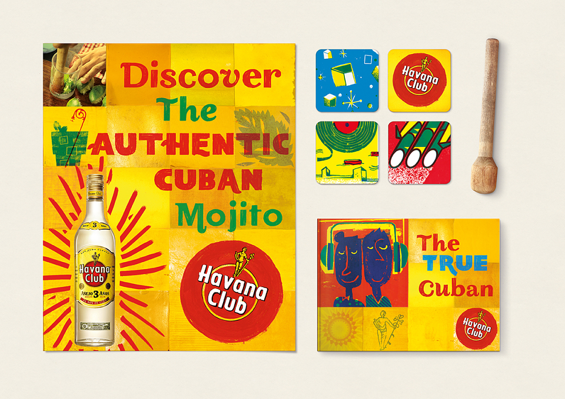

I'm really glad to be back on the course and I'm super excited to get started with GDE740 this week - I feel much more focused after taking a break. I also feel like I've learned a lot about myself and my practise 
while I've been gone - I've recently started to learn web development and coding, and I'm absolutely loving it. I've realised that I'm so fascinated in the intersection between design and tech, so I'd love to bring this into my work moving forward!

To start this module, we're starting a four week project that focuses on the theme of self-initited projects in graphic design. I've always found this theme interesting, as work and play can so easily become blurred when you do something creative that you're fundamentally passionate about for a living. 

I've always found it hard to find time to work on self initiated projects. It's frustrating as I wish I had more time to dedicate to personal projects, but this is something that was touched on briefly during this week's lecture which I really appreciated, and it made me realise that I'm not the only graphic designer who faces this problem.

There were so many great insights into the nature and importance of self-initiated projects this week. I personally feel that self initiated projects are a great way to really reclaim your practise and define who you are both as an designer and as a person.

## Lecture Reflections

As mentioned, this week's lecture was all about self initiated work, with a particular emphasis on balancing work and play and where to find inspiration and ideas. Each creative practitioner answered questions related to how they've approached and developed self initiated projects in the past, and many discussed how they'd like to make time ot develop more in the future. 

The range of pracitioners in this week's lecture was so diverse, and I found it really interesting to hear how each found inspiration and ideas for self initiated projects, From a practical perspective, it was also interesting to see how these projects are then practically structured and organised, particularly when they have to be planned around other commercial work.  

A practitioner who really stood out to me this week was James Stringer from Werkflow. I absolutely loved the project that he was discussing - Sovereign - a first person, magical realist adventure game, set in the fictional suburban town of Bridewell in England during the early ‘noughties’ (cite). 

<figure class="video-figure">
<video controls width="100%">
  <source src="/videos/Sovereign Teaser Trailer by Werkflow - Werk Flow (1080p, h264, youtube).mp4" type="video/mp4">
  Your browser does not support the video tag.
</video>
<figcaption>Fig 1. The trailer for Werkflow's 'Sovereign' game</figcaption>
</figure>

I found James' insights into self initiated work really interesting. I loved hearing about where inspiration for the game came from, and I loved that it's story and theme is rooted in personal experiences. I feel like this is such a special example of a self initiated project because it really came from the heart - James wanted to use digital storytelling to present a realistic and sympathetic insight into the lives of British teenagers and relay his own experiences. 

This really resonated with me and got me thinking about the importance of storytelling. Storytelling is such a powerful tool - it can open minds and comfort people. Video games are a particularly compelling example of interactive visual storytelling, and therefore a great way of helping someone to really experience an event as if they were there, which can heighten empathy and understanding. 

James got me thinking about how important storytelling is to me in my own self-initiated work, and how powerful it is as a tool. I love to write in my spare time, and a lot of my stories are based around personal experiences and things that are happening in the world, particularly things that I find unfair or frightening - maybe an interesting option for this project could be to experiment with bringing one of these stories to a graphic landscape?

I also really loved 'Design your Life' by Vince Frost. I particularly related to what he said about noticing problematic patterns he was facing in his own life, and using design thinking to solve those problems and enhance his overall wellbeing. Problem solving is such a key part of design, and in the words of Saul Bass, *italic*'design is thinking made visual'*italic*, so as designers there's no reason why we can't bring that problem solving mindset outside of design to enhance other areas. 

As a neurodiverse person, I often use tech and design thinking to solve problems in my own life, too - I'm constantly designing and developing new planners, timers, apps etc. to help me feel more productive and less scatterbrained. I'd love to share these apps with others some day, to hopefully help other neurodiverse individuals who might find them useful. 

I think sometimes the most innovative ideas come from self-initiated projects, because you're not working with any fear or judgement or shame. When you're building something that you know will be useful to you, you might have no intention of putting it out into the world, but when you do it could really enhance the lives of others. 

This got me thinking about possibly considering how design thinking can be used as a tool to enhance lifestyle and productivity as something I could develop further in my self initiated project. 

## Looking back & initial ideas 
It was reccomended this week that we look back at work from the very first module, GDE710, to try and gather some ideas for potential development, so I started this week by looking back at my older work. I've been feeling a bit disconnected from my practise recently, so the opportunity to go back over some older work and think about what really matters to me as a practitioner was very helpful. 

It took me a while to familiarise myself with what I had actually gotten up to in GDE710, as because of my period of intermission, it was technically three years ago now (which is crazy). I feel like I've changed so much as a practitioner and a person since GDE710, but I loved looking back at the work I'd completed. Most importantly, it gave me so many starting points and so much inspiration. 

It was outlined this week that one thing the project needs to do is respond to an issue, cause or narrative that is important to us, so it's important to make sure that this project is valuable and fulfilling, which is something that I always like to try and make sure my projects are. 

I'd like to choose a subject or theme that is quite personal, especially considering that the next brief, 'Industry Set', could end up being more commercial. I also think that by nature, a self initiated project should be something that’s personally important, as it’s rare that we get the time to work on them - it's nice to have the opportunity to do that now.

### My place in the Industry 
Before I intermitted, the first thing I did to start this module was consider my identity and my place in the industry. As I mentioned, I feel like I've changed quite a bit since then, so I'd be interested to look back at what I wrote three years ago, and compare it to who I am now. 

### Who am I?
I am a freelance graphic designer, illustrator and front-end developer, with a goal to work in-house as a web designer/developer, a UI/UX designer or as part of design team. My interests include packaging design, brand design, social media and marketing. In my free time, I love to write and draw, and I enjoy designing characters and creating comics and graphic novels.

### Recurrent themes in my work 

- Social justice
- Mental health
- Humour
- Feminism
- Storytelling and narrative

### My Current Skills: 

- Illustration (editorial, commercial, character)
- Graphic design 
- Web Design
- Front-end Development (HTML, CSS, JS, React etc.)
- Brand design and strategy
- Packaging design
- Editorial design
- Creative writing
- Drawing
- Copywriting

### Skills I'd Like to Develop

- Continue learning coding languages (back-end, software dev, etc.) 
- Animation and motion graphics
- Typography (my use of type is and has always been awful.)

It was really interesting to look back at the list I made three years ago, as a lot of the skills that I wanted to develop back then are skills that I have now developed (such as coding), which was great to see! Back then, I wanted to use this project as a way to address some of my skill gaps, and I could certainly still do this. 

This skills audit also helped me to realise that there's a divide in my overall creative practise straight away, between commercial design work and my personal practise (illustration, narrative/graphic novel work). As mentioned by Offset Studio in this week's lecture, as a creative person who works in the creative industry, work and play can become very blurred, so I try to keep some aspects of my practise, such as graphic novel and narrative work, exclusively self initiated with no goal to try to monetise, commercialise or even really share that work in any way (unless the opportunity arises, but I won't go searching for it) because it's very personally important and therapeutic to me.

This got me thinking about possibly doing something graphic novel or storytelling related for this project, as I feel like that's a cornerstone of personal, self-initiated practise for me. It might also allow me to experiment with type, layout and hierarchy, which I've indentified as an area I want to work on.  

Before intermitting, I also considered how this project could possibly align with my long-term goals - Initially, I wanted this project to be one that could help me to advance my career, but I realise now, especially after listening to the lecture again, how that goes against everything that a self-initiated project should be. While self-initiated projects can be monestised or commercialised, they're usually something that comes from a personal interest or passion rather than a professional goal. 

However, I agree with the other two criteria that I outlined for my project originally a lot more:

- I'd like this project to allow for skill development, by enabling me to explore a new area without fear of failure or judgement. 

- I want this project to send a message. I love using my work to tackle themes and issues that are important to me, to raise awareness and hopefully help others.

## Previous Ideas from 2023

### Disability Awareness

Back in 2023 I identified disability/neurodiversity awareness as a recurring theme in my work and something I'm deeply passionate about, especially after looking back at my work for Week 4 of GDE710, 'The Self and Identity'. 

As someone with a hidden disability myself, I feel like the potential of design and tech to enhance the lives of people with disabilities, educate people about disabiltiies and support the carers and loved ones of people with disabilities, is really endless. 

### Mental health 

Another recurring theme that stood out to me when initially brainstorming ideas way back in 2023 was mental health. I've personally gone through struggles with my mental health, and I strongly believe that art, design and tech have huge potential to both be therapeutic as a practise, and can be used as a means to develop solutions for people who are struggling.

(find an artist) 

Although it's important not to be insensitive, I love to use humour to enhance these themes because I feel like it's a great way of coping. During my BA, I developed a pack of passive-aggressive affirmation cards that I really wanted to finish but never got the chance to - A simple project like finishing those cards or creating something similar could be a nice way to get back into things, and could link to the illustrative side of my practise well.

Design based activism 
Burnout rescue box
Like a joke subscription box
Or some kind of product to help with burnout 
Merging narrative with branding and packaging
Humor to deal with mental health problems 
Looking on the bright side
Merges a lot of the elements of my personal practise 

### Music 

Music is another huge passion of mine - I've always loved to sing and play music and I've recently gotten really into music production and DJing, as they intersect music and tech in such a satisfying way.

After looking back through my GDE710 work, I noticed that I'd touched on the intersection between music and graphic design briefly in Week 3.

I thought back to my research into design for the music industry, common audio-visual trends, music festival posters, and the concept of auditory type, and considered that maybe this could be an interesting area to develop further that would allow me to integrate and develop newfound skill and interests. 

### Small business 

Sometimes, I get quite frustrated living in Plymouth, UK, because there aren't many in-house tech or design jobs available here. However, after looking back at my work for week 2 of GDE710, I realised that a key hallmark of Plymouth's identity is small business, with a particular focus on arts and crafts. 

In this sense, Plymouth is a great place for designers, as there are small businesses everywhere looking for rebrands, logos, websites and even marketing assistance. 

I identified this as a potential subject for my project - Maybe I could find a business that resonated with me and create work for them, or maybe I could create my own fictional brand to develop an identity and strategy for?

### Storytelling 
As mentioned, another huge theme in my work that I identified way back in 2023 was the power of storytelling to make social change. As an illustrator first and foremost, storytelling is at the heart of everything I do. Now that I've started to look into coding, programming and web, I feel like there are so many unique ways to tell stories and share them. 

(find examples of storytelling as therapy, storytelling in advertising/marketing)video games, interactive advertising/ARGs

I developed a zine of testimonies while making the spiking project that gave the project a personal touch.Maybe something related to this? 

https://www.itsnicethat.com/features/henry-gorse-my-yard-changemakers-grange-farm-book-photography-240322 
Life more abundant
Digital horror
Digital storytelling (args etc)
Social media marketing 

Narrative through social media marketing? Like an ARG to promote 
Mmm interesting tasty

## Current Ideas

As well as looking back at ideas from my first attempt at this module, I went back over my work for GDE710 with fresh eyes this week to see what stood out to me, to try and develop some new ideas for this four week project. 

### Analogue Mediums

I really loved week 2 of GDE710, 'Industry Today', where we looked into the history of design. This really was a first look into the history of graphic design for me, as I was totally new to the field having come straight from an Illustration BA, and I found it absolutely fascinating. 

Something that really stood out to me during my research for 'Industry Today' was how trends and techniques change, and in turn, how advancements in technology determine the latest trends. I loved looking at old penguin book covers and seeing the gritty, analogue textures and illustrations created with mixed media, as well as collage-based, analogue-heavy movements like Dadaism, and the fanzines of the 90s - a far cry from today's clean, tech-heavy graphics.

Analogue textures and mixed media are not only design techniques/aesthetics that I personally love, but they are very popular at the moment in the graphic design space. I think that the current popularity of these mediums and tecniques is largely because they serve as an antidote to the influx of incredibly tech-heavy, clean design that is present at the moment. The insurgence of AI has definitely had a hand in this, and the idea that a machine could potentially do designer's or artist's jobs is an ever present danger. 

As a graphic designer, I see the use of analogue textures and mixed media as a quiet act of rebellion against the polished sterility of digital design. In an era where AI can generate flawless, hyper-clean visuals in seconds, the imperfections of hand-made marks, torn paper, paint strokes, and layered materials feel deeply human, and serve as an antidote to the algorithm. These tactile interventions disrupt the screen's smooth surface, reminding us that design is not only about precision but also about presence, process, and personality. There's something so unique, full of personality and rebellious about choosing analogue media to create a design in a world where tech is so accessible and frequently becoming ever more commonplace in creative fields. 

During Week 1 of GDE710, I briefly touched on the importance of a 'human touch' in graphic design, and how details such as hand-drawn illustration can make commercial projects feel more approachable and human. A campaign that utilised traditional mediums as a direct statement against AI recently was The Guardian's coverage of the UK Election. In 2024, the Guardian's creative team made all of their election artwork by hand, partly inspired by the notion of 'broken Britain', and in direct response to the rise of AI generative imagery and fake news (cite)

All of their artwork for the election coverage was made with deliberately imperfect paper cuttings. Harry Fischer, lead digital designer for the Guardian, and Chris Clarke, creative director, discussed in an interview with It's Nice That how the idea came about and why the team chose this approach, stating that they were inspired by the idea of what 'trust' looks like in 2025. They discussed how the 2024 election was likely to be one fought with misinformation and lies, and that they therefore responded with a real, approachable look and feel in their coverage. 

>"The main spark of inspiration came from a conversation with a desk editor describing the country as ‘broken’, with nothing fitting or working quite as it should. This in parallel with the rise in disinformation, and fakery either through AI or generative articles really cemented the idea to do the direct opposite and be as honest and transparent in the creative process as we could – to lean into the craft of doing things for real." *Chris Clarke, Creative Director at the Guardian*

I love the idea of analogue, mixed media textures being a direct rebellion against the current digital age, and the misinformation and deception that digital mediums and AI technology can bring. I'd love to potentially explore this further in my final project for these four weeks 
 
### The Importance of Imperfection 

The idea of rebelling against the sterility of digital perfection leads well into my next area of interest for this project - imperfection, particularly in relation to identity and mental health. 

During Week 4 of GDE710,'The Self and Identity', we took a look at ourselves and our values and made moodboards based on each of these. One of my values was 'imperfection', and that definitely hasn't changed. It might seem like a strange value to have, but I think imperfection and vulnerability are traits that it's not only hugely important to accept, but also to be open about.

In today's digital age, the idea of 'perfection' is everywhere and something that people, perticularly young people, are taught to aim for. Young people, in particular young women, are shown a version of reality that is not only usually heavily manufactured but also likely totally unattainable by social media 'influencers'. 

Tiktok trends like *'clean girl'*, *'looksmaxxing*' and  *'thinspo'* perpetuate harmful messages about appearance, and a lot of 'lifestyle' and 'study' content that is supposedly candid portrays a toxic and filtered idea of reality which pushes perfection as a bare minimum that should come naturally, which is unrealistic and unfair. 

From a feminist perspective, things are worse than ever these days for young women - as the use of AI models becomes more frequent and commonplace, young girls are being taught to aim for beauty standards that are not only unattainable - they aren't even real. 

I think embracing imperfection and the reality that things aren't always perfect (in fact they rarely are) is hugely important. I know that in advertising, an idealistic worldview is usually just part of selling a product, but I think we owe it to people, especially young people, to show them a realistic version of the world to encourage tham that it's okay to be human. 

Something Vince Frost said really stood out to me this week: 

>"When you’re a young person, or just starting out, you think everybody’s got everything worked out and the world’s kind of a scary and new place and really this helps to kind of ground you and make you realise that we’re all the same, we’re all here doing our best, and we can learn from others.” *Vince Frost*

I'd love to maybe use this as a theme to start my project, taking the idea of imperfection and presenting it as something that's totally normal, rather than something to be ashamed of. I can see how this could also potentially link to my first idea, as half of the charm of analogue mediums is in their unique imperfections. 

I loved looking at artist and designer's sketchbooks during GDE710, as they're a great example of how, without the chaotic imperfection of the first draft, you'd never get a 'perfect' final product. 

John Berger once said: 

>Drawing is a constant correction of errors.
Maybe a great deal of creation is actually that. *Berger, 2017*

So maybe traditional drawing is the perfect medium through which to show that errors and imperfections are totally normal and healthy? It's definitely something I'd like to explore. 

### Culture and Human Rights

During Week 11 of GDE710, 'Trends and Environments', we looked at the concepts of signs and semiotics. Something that I noticed when looking through the content for this week was my reaction to seeing the Union Jack flag. Jarringly, my reaction to seeing the flag now was totally different to way back when I first wrote this entry in 2023 - this is because of the flag's current connotations. 

In recent years, the Union Jack and St George’s Cross have been increasingly co-opted by Reform UK and other far-right groups as visual shorthand for nationalism, with the flags appearing not only in political campaigns but also painted across streets, road signs, and public spaces in ways that often sit outside of formal regulation. While supporters frame these displays as expressions of patriotism and national pride, for many, particularly immigrants and people of colour living in the UK, the imagery has become fraught, associated less with inclusivity and more with exclusion, racism, and far-right rhetoric. As a result, what was once a broadly recognised national emblem has, in some contexts, come to carry connotations of fascism, hostility, and hate.

The rise of right-wing politics and fascism in the world today is something that terrifies me, and it's crazy to me how quickly a simple symbol can be adpoted to have (in my opinion) hateful connotations and instil fear in people. 

For these reasons, I was considering whether my project could take a look at signs and semiotics within culture today. Something that could also be interesting to investigate is whether global practise and collaboration within creative industries could be seen as an antidote to fascism and xenophobia. 

I personally feel that the risk we run with nationalistic pride is ending up in an echo chamber where, not only do we not accept other cultures, but we also fundamentally don't understand or communicate with them, which is incredibly dangerous. It's important for us to know what's going on around the world and in other cultures, even if we don't necessarily agree with those views. I loved projects such as the Havana Club by Pearlfisher UK, which took a multicultural look at design practise to create a bright and insightful project inspired by multiple cultural ideals and visual motifs. 

 

Another possibility for this theme is that I could take a look at the concept of culture or nationality through a visual lens, and how the world's increasing favour of right-wing nationalism might affect the design landscape. 

In GDE710, I loved looking back at the work of Dunne and Raby and their futuristic speculative design. Their strange projects that take a bizarre and sometimes bleak and frightening look at potential human futures really stood out to me, considering the current state of the world. 

I also loved the work of studios like Forensic Architecture, a research agency at the University of London who use advanced interdisciplinary techniques and mediums, such as technology, art and design, to investigate state and corporate violence. 

I absolutely love what Forensic Architecture do, and feel like this is a great example of how design and tech can be used as powerful tools when it comes to social justice and human rights. Maybe I could use this project to look more into how design can be used to build a better, fairer future.

### 'Message Delivered' 

After looking back through my work for GDE710, the entirety of Week 9, 'Message Delivered', really stood out to me. As mentioned in my previous idea, I love sending messages through design, and I feel like art and design are some of the best mediums through which to promote real world change. 

One of my best experiences as a designer/illustrator so far was when my project 'Angel Shot' won first place at the Creative Conscience awards 2022. I developed the project as a way to send a message about anti-spiking and women's safety by developing safety conscious packaging for an alcohol brand that promoted these values. This was my first time developing a project where the medium was the message, and I was satisfied with the outcome - using the medium of alcohol packaging to get the message across was a really fun way to promote the cause, and something that really motivates me as a designer is doing my bit to help causes or subjects that I feel strongly about.

During Week 9, we took a look at the concept of *'the medium is the message'*, an idea coined by Marshall McLuhan, which asserts that the medium through which a message is sent is just as important, if not more important, than the message itself. 

We looked at so many great examples of design that sends a message not just through it's content, but through the medium itself in GDE710, but one that has stood out to me recently was the BBC's 'Vote Stamp' campaign. 

In 2024, the UK government announced that photo ID was now necessary to vote during an election, however Electoral Commission research found that 33% of young people still forgot their ID or were totally unaware of the change. 

To tackle this, the BBC implemented a campaign in which, after viewing and accepting ID, bouncers at UK bars and clubs would stamp the wrists of young people after granting access with a stamp that said 'You need ID to vote, too". 

The creative director of BBC Creative was quoted as saying:

 >*"If they didn't spot it that night, they would see it on their arm the next morning."*  

This project is a great example of medium as message, and how these innovative approaches to sending political and social messages can be hugely effective in the promotion and retention of that message. 

I'd love to take inspiration from creative approaches like these in my project, and maybe utilise similar techniques to send messages about causes that matter to me. I'd love to possibly take another look at some of my previous ideas from GDE710 which I now feel were a bit aggressive, such as the women's safety posters, and refine them with a mor etasteful approach, which is something that is really important when tackling difficult subjects. 

## Final Ideas and Brief

Our aim for this week was to turn our ideas into a final, comprehensive brief. I honestly found it really difficult to settle on one area to focus on, but two ideas were really standing out to me - analogue mediums in the digital age and embracing imperfection and authenticity.

To help myself pinpoint a final concept, I considered the criteria for this project, how it needs to be based on our individual interests and passions, taking risks and considering how our work might fit into a wider context. I feel like this project could be such a powerful way to get back into making work and considering what motivates me as a designer, so I want to take a very personal approach. 

I considered the two concepts of analogue mediums and embracing imperfection, and felt like they could merge Maybe I could do something interesting using mixed media and analogue mediums that would attempt to tackle the toxic messaging towards young women on social media? Maybe an animation? Using messy analogue mediums to send that message would be a great use of medium as message, and bring in a storytelling element, and I felt like there was something really exciting there.

Aside from this, toxic perfectionism is something that I've been struggling with recently, both personally and creatively, so I feel like it's a personally poignant subject. Recently, I've been feeling really defeated and unmotivated when it comes to creative work, and I think that this is because of all the perfect, polished work that I've beeing seeing online. Not only do I tend to compare myself to others, which causes me to feel unmotivated and too scared to even start making work, but I often reject my own unique creative identity in favour of 'fitting the mold' and making commercially successful or 'popular' work that fits into the 'clean' and 'professional' digital landscape. Using analogue mediums in a project like this would force me to be free, messy and reject perfectionism, and would be a great way for me to break back into making creative work, as well as a therapeutic way to send a message about how imperfection is what makes us human. 

For this reason, building some briefs based on this intersection - imperfection, identity, and analogue storytelling as resistance to digital perfectionism, seemed like the right way to go.

Before I started to develop my brief though, I took a look at this week's resources

Using this research, I decided to start coming up with a comprehensive brief. 

Here's where things got a little out of hand. 

The topic of human imperfection vs digital perfection gave me so many ideas that I ended up coming up with 5 briefs, because I love to make things as hard for myself as possible. I wrote each one up as a polished final brief.

### 💡 Concept Direction 1: “Unfiltered” 

**Core idea:** 

Reclaiming imperfection in a polished world. A mixed-media campaign that celebrates imperfection and authenticity, challenging the perfectionism perpetuated by social media and AI.

**Aim:**

 To explore how analogue imperfection (texture, mess, unpredictability) can visually and emotionally communicate the value of being real and human in a digital culture obsessed with perfection.

**Mediums:**

 Collage, scanned paint textures, hand lettering, risograph or photocopy prints, stop-motion animation, or short experimental video.

**Possible Outcomes:**

- A short hand-animated or stop-motion video piece
- A series of posters or social graphics that subvert beauty filters and AI “perfect” aesthetics
- A zine titled Unfiltered that combines personal reflection, analogue experiments, and found social media imagery

**Audience:**

Young women / creatives navigating self-image pressures online

**Wider context:**

Links to current conversations about authenticity, “deinfluencing,” anti-filter movements, and AI-driven beauty standards

**Potential development challenge:**

How can design look deliberately imperfect yet still communicate clearly and powerfully?

### 💡 Concept Direction 2: “404/Human Error”

**Core idea:**

Designing with mistakes, baased on the concept of human error. Treat mistakes, smudges, and glitches as design tools rather than flaws.

**Aim:**

To investigate the visual language of “human error” — exploring what happens when a designer embraces failure, randomness, and manual process as a creative methodology.

**Mediums:**

Analogue printmaking, photocopy distortion, glitch scanning, painting over digital prints, generative “error” techniques

**Outcome ideas:**

- A digital/print hybrid publication documenting experiments
- A typographic poster series visualising human vs. machine imperfection
- A short film/animation that evolves from “machine-perfect” to chaotic and alive

**Audience:**

Design students / creative professionals reflecting on authenticity and automation

**Wider context:**

Questions about authorship and humanity in the age of AI

**Personal challenge:**

Overcoming your own perfectionist tendencies by allowing spontaneity and imperfection in process.

### 💡 Concept Direction 3: “Visible” — The Messy Beauty of Mental Health

**Core idea:** 

A visual storytelling project using analogue mixed media to explore the raw, imperfect emotional reality of mental health struggles — embracing visible “cracks” instead of hiding them.

**Aim:**

To visualise internal experiences (anxiety, burnout, overwhelm) through imperfect physical processes like tearing, layering, erasing, and rebuilding.

**Mediums:**

Collage, scanning, layering ink/paint textures, stitched or torn paper, voice-over storytelling, animation

**Outcomes:**

- A short experimental film/animation using voice and mixed media
- An illustrated zine or poster series
- An interactive online exhibition (documented via your blog)

**Audience:**

General public — particularly those dealing with self-image and mental health challenges

**Wider context:**

Links to campaigns around mental health awareness and self-acceptance

**Personal challenge:**

Turning something deeply personal into a universal message through visual metaphor and process.

### 💡 Concept Direction 4: “Digital Detox” 

**Core idea:**

Analogue resistance in the digital age - Exploring analogue mediums as resistance to digital homogeneity and rejecting digital perfection as an artist/designer.

**Aim:**

To explore how analogue techniques (printmaking, scanning, physical manipulation) can disrupt or humanise the slick, algorithmic visual language of digital media.

**Mediums:**

Riso, print, paint, scan, glitch, layering with digital manipulation

**Outcomes:**

- Visual identity or campaign for a fictional movement advocating digital detox / creative authenticity
- Poster or motion series combining digital and physical layers
- Interactive microsite (if you want to flex web design skills too)

**Audience:**

Digital creatives, designers, students

**Wider context:**

Commentary on AI art, creative authenticity, and digital burnout

**Personal challenge:**

Balancing analogue experimentation with digital execution — showing how imperfection can enhance clarity and impact.

### 💡 Concept Direction 5: “Medium as Message” — Storytelling Through Materiality

**Core idea:**

A narrative told entirely through the medium itself — using material choice, texture, and imperfection as narrative devices.

**Aim:**

To create a short visual story or sequence (poster, book, or video) where the materials become the meaning.
 
**Example idea:**

A story about online perfectionism told through decaying prints, peeling stickers, fading ink, or handwritten confessions that get messier as they go.

**Mediums:**

Photography, collage, stop-motion, typography, sound design

**Outcome:**

- A short film or animation (1–2 minutes)
- A narrative poster sequence or artist’s book

**Personal challenge:**

Combining conceptual storytelling with strong design craft.

At this point, I was really struggling to choose a project to mvoe forward with. In terms of output, direction 4, 'digital detox', excited me the most - I loved the idea of creating a visual identity or campaign for a fictional movement, and I really wanted to bring in some web design to keep growing my web design skills. I also felt like telling a story using analogue mediums through a website or online exhibition could be really interesting. 

In terms of which ideas/themes I felt best connected to, I was totally torn between directions 1, 3 and 4. I was wary of merge these ideas too much, because I wanted to avoid a muddy, chaotic brief, but I fely like maybe it was somehow possible to kind of merge all three of those themes into a kind of broader 'detox' themed project - maybe a campaign that more widely investigated what it means to be a human in the digital age, that touches on issues of mental health, body image and creative authenticity, looking at how AI and social media affect both creatives and the general public, that makes use of analogue mediums to rebel against AI and digital perfection and enhance the message.

Based on this, I developed a final brief for my self initiated project. 

## 🎯 Final Brief - 'Detox'

**Core Idea**

A visual identity and campaign exploring imperfection, authenticity, and creative rebellion in the digital age.

**Rationale**

In an era defined by algorithms, filters, and automation, the human touch has become a radical act. Human After All explores the growing tension between digital perfection and emotional authenticity — investigating how AI, social media, and digital design culture have reshaped the way we see ourselves, our creativity, and each other.

The project challenges the constant pursuit of refinement and control by embracing imperfection, analogue craft, and raw emotion as symbols of resistance. It aims to question what it means to create, express, and exist authentically in a world where our identities and aesthetics are increasingly shaped by machines.

By combining analogue experimentation with digital media, the campaign seeks to reintroduce feeling into visual communication — reminding us that imperfection is not a flaw, but proof of life.

**Objectives**

- Investigate how digital environments (social media, AI tools, online identity) impact human emotion, body image, and creative authenticity.

- Experiment with analogue techniques — collage, photocopy, print, and texture — as tools of creative rebellion and self-expression.

- Develop a cohesive visual identity for a fictional campaign/movement (“Human After All”) that advocates for reconnection, authenticity, and imperfection.

- Integrate digital and analogue media through a web-based or digital exhibition format, using interactivity and storytelling to immerse the viewer.

- Reflect critically on the relationship between imperfection, emotion, and authenticity through the design process and outcomes.

**Deliverables**

- Visual Identity: Logo, colour palette, and typographic system for the Human After All campaign.

- Campaign Materials: Poster series, zine, or print ephemera showcasing key messages and visuals.

- Analogue Experiments: Scanned and digitised textures, collages, and compositions that express human imperfection.

- Digital Exhibition or Microsite: A small, immersive web experience that merges digital and analogue worlds, presenting the campaign’s narrative.

- Short campaign video or motion piece exploring the project’s message in a unique visual medium

**Research Questions**

- How has the pursuit of digital perfection influenced our perception of creativity, beauty, and self-worth?

- In what ways can analogue and handmade processes reintroduce emotion, authenticity, and imperfection into digital design?

- How might graphic design serve as a form of resistance against algorithmic homogenisation and creative conformity?

- What visual or emotional language best communicates the tension between human imperfection and machine precision?

- How can interactivity or digital storytelling amplify the emotional resonance of a campaign about reconnection and authenticity?

**Keywords**

Authenticity · Imperfection · Analogue · Rebellion · AI · Digital Identity · Creative Burnout · Human Connection · Visual Storytelling · Design Ethics

**Tone & Aesthetic**

Raw · Reflective · Honest · Poetic · Handcrafted yet digitally integrated — a visual contrast between glitch and grain, pixel and paper.

## Research Task

Your research task this week is to assess the field of communication within which you want to develop your self initiated project.
​
design and mental health 
packaging design
brand design
web design possibly and social media marketing 
looking at some of the examples last year
people who use social media to spin narratives and create engaging experiences 
​
Who are the designers, artists and makers that are critical to this area of design? How might their work inform your own creative direction?

https://www.itsnicethat.com/articles/icbq-issue-five-publication-190121 
https://www.itsnicethat.com/articles/amy-moss-illustration-270421 

## Next Steps
- Plan for Week 02…

## References

https://ukgamesfund.com/funded-project/sovereign/
https://www.itsnicethat.com/features/the-guardian-election-editorial-graphic-design-illustration-spotlight-140624?.com  
