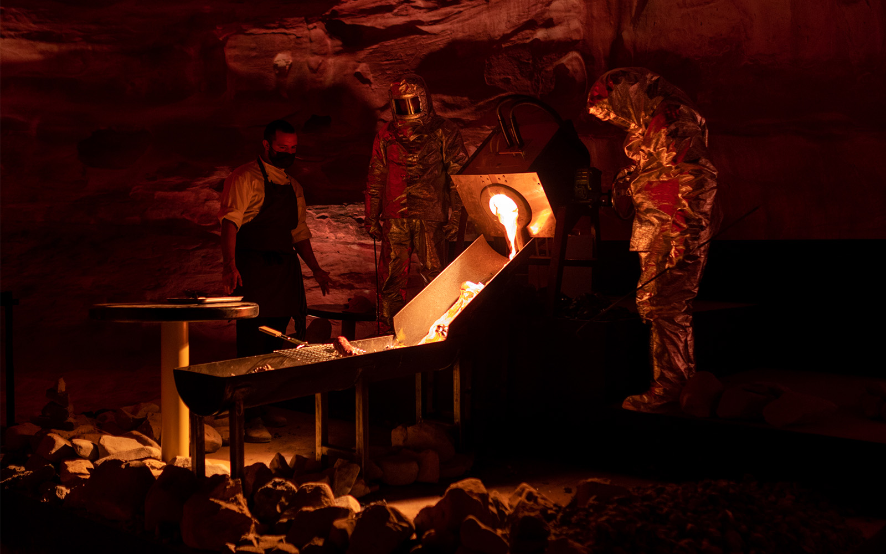
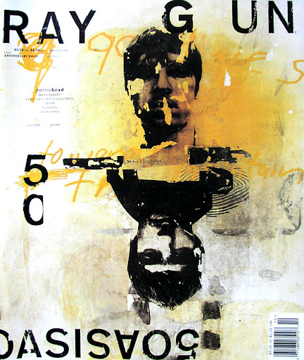
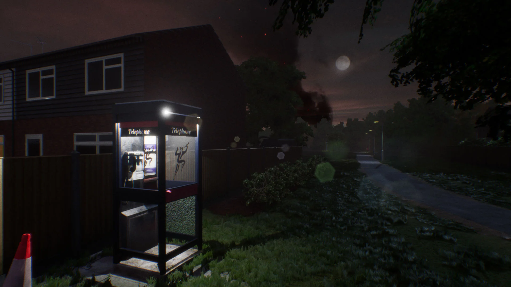
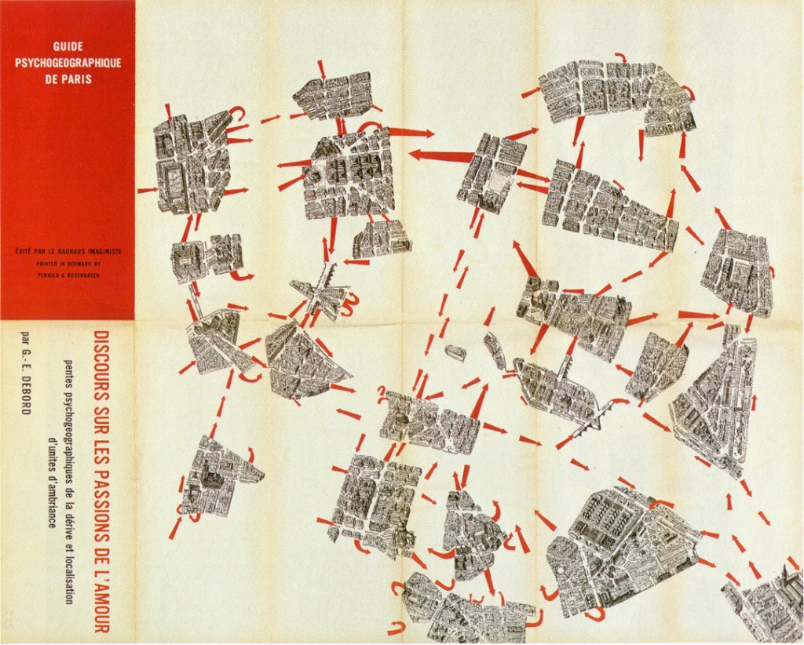
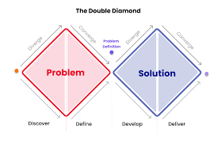
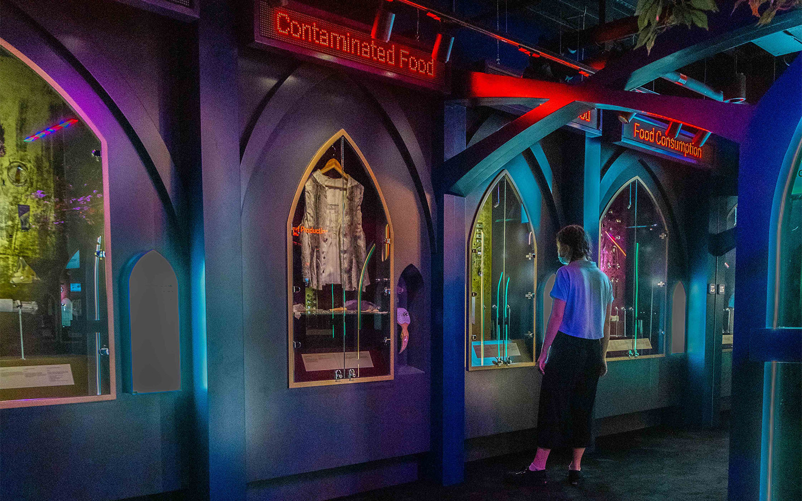
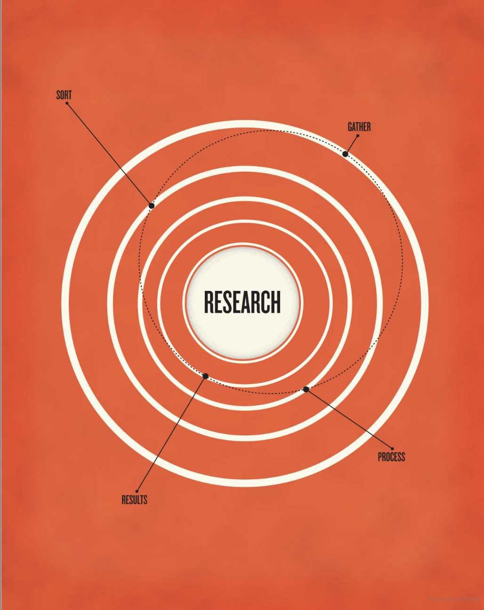

This week, we're moving into the idea development and planning phase of our self-initiated project. During this week's lecture, we explored concepts of idea generation, craft, and how context and contemporary theory can enhance and inform idea generation and project planning. 

I'm really excited about my current project idea - I feel like it's an area of great personal interest for me, and will allow me to experiemnent and embrace risk while also hopefully regaining a genuine love for design. I'm looking forward to developing it further this week. 

## Lecture Reflections

>"Ideas are good. But where do you get them? Some people believe they fly around like radio waves just waiting to be captured by the brain's receiver. Perhaps it is the way some people, those who wear silver foil on their heads, get them. But the majority of us develop ideas from terra firma - or rather quantifiable fact. Even most fiction is built on fact." *Steven Heller, 2013*  

In this week's lecture, the creative practitioners gave insights into their own research and development processes. They answered two key questions - 'How do you visualise and develop your initial ideas?' and 'what are your points of inspiration, theories and reference?'.

Sam Bompas emphasised the importance of research in this week's lecture, stating that *'you can't have a good idea in a vacuum'*, which I completely agree with - To me, research is like the skeleton of a project, and without it, it will often be superficial and meaningless.  As was emphasised in this week's lecture, good research can form a stable, strong foundation for a project. 

Something that really struck me about this week's lecture was how broad and different everyone's processes where, which really got me thinking about how every creative person will have a process which is unique and deeply personal. For example, some practitioners, such as Vince Frost, prefer to sketch out their ideas, whereas others, like Sam Bompas of Bompas and Parr, preferred to write their ideas down. Vince Frost has a very exploratory and intuitive creative process that's very similar to mine which was nice to see - he likes to sketch first until ideas start to flow, and he enjoys hands-on experimentation and play with design software. 

Another area of this week's lecture that really interested me was hearing the pracitioners talk about their points of reference and creative inspiration, and t was interesting to see a couple of practitioners talk about how they enjoyed merging both historical references and modern, contemporary references. For example, Christoff Miller of Offshore Studio said that he was greatly inspired by the neatness of Swiss design, but loved bringing in the disruptive, messier elements of modern, contemporary sculpture. Veronica Fuerte also mentioned that she loved taking inspiration from the modernist style of the 60s and 70s, which she described as a 'good basis', but she tries to bring in modern and contemporary elements that will appeal to multiple demographics. 

I found this really interesting, as this is something that I love to do in my own work, and I personally feel like it's so important to build on points of reference rather than just try to embody them as they are. This was also something that I feel is very relevant to my self-initiated project concept - I feel like a lot of my research this week will possibly be based around the traditional, analogue mediums and techniques of the 70s, 80s and 90s, but integrating modern, digital outlets, elements and concepts.

I loved hearing about Werkflow's wide range of multi-disciplinary inspirations. Game design is such a huge area that encompasses so many different aspects and practises, such as storytelling, music, coding, etc. Because of this, I'm not surprised that there can be so many different points of reference for games. I loved that James Stringer said they he was inspired by social realist cinema, as I feel like the bridge between game and film is so noticeable and very interesting. This got me thinking about how sometiems it's important to look at references that maybe are seemingly unrelated to your field, as interdisciplinary research can bring so many great ideas and make a project really rich and layered. 

I found listening to Werkflow particularly interesting this week. I found it fascinating to hear about how a game is developed from concept to final piece - how the idea started as a script, then turned into a design bible, and then went into development. I was especially interested when James mentioned that he felt that skill gaps and technological setbacks had stopped the team from reaching the full potential of their project, 'Sovereign'. I think with a medium like video games, which is so complex with so many moving parts, it must be hugely difficult to create a final product that maintains the core heart of the initial idea. I feel like this is also relevant to campaign or visual identity development - there are so many moving parts that have to come together as a cohesive whole, but in the end it's all about storytelling, and it's important not to lose the heart of the initial concept or story that you want to tell.

Just as when Sam Bompas emphasised the importance of embracing the individual skills of everyone in a team when he mentioned that everyone has their own way of visualising and noting down their ideas, Christoff Miller made some great points this week about working in a team. He emphasised that everyone's creative process is totally different, and that this should be embraced. Christoff's mention of the 'third mind', a phenomenon that occurs in a team working scenario, reminded me a lot of the 'six thinking hats' analogy that we touched on in Week 5 of GDE710, 'Thoughts on Ideas'. The 'six thinking hats' analogy emphasises the importance of collaborative thinking. As everyone in a team will have a unique, individual set of skills,engaging with others, and in a wider sense, the world around you, will result in a broader, richer project. 

Thinking back again to 'Thoughts on Ideas', I loved what Vince Frost said about how he gathers inspiration. He mentioned that he is always on the lookout for inspiration and that everything can be a source of inspiration. He said that he gathers the majority of his inspiration from the world around him, the city he lives in and the people around him. 

This got me thinking back to the concept of 'looking vs seeing', which we also touched on in GDE710 - looking at the world around you in a deeper way and using that as a means of inspiration. I especially related to what he said about noticing things that frustrate or upset you, and then using them as a launchpad for projects. What Vince said about being particularly inspired by walking and wandering reminded me of the concept of 'Dérive', coined by Guy Deboard and the Situationists, which encourages walking with no aim or purpose other than to take in the world around you, which I personally use as a method of gathering ideas all the time. 

Christoff Miller mentioned that he and his team engage in a range of different research and idea generation methods, such as reading, visual references and physical experimentation. I found it interesting that Christoff mentioned that he found his process quite hard to pin down, which I really identified with - my process can be very sporadic and unpredictable, and I find that often my best projects come from less linear processes, where I let my ideas and intuition take the lead. 

However, even though the creative process is often chaotic and non-linear, there are a lot of research-driven methodologies and processes that are designed to prompt ideas and act as frameworks for project development that are proven to work, as they're often developed by creatives for creatives, such as the Double Diamond model. Overall, though, Christoff said that it's important to stick to what works for you as an individual. 

I really liked what Sam Bompas said this week about not being afraid to get messy when it comes to research and experimentation. Sam mentioned that he's always coming up with ideas and slotting them away for future reference, which I think is a great idea, but that 90% of those ideas are total rubbish and that's okay, and he mentioned that some of his best ideas have come from messy napkin sketches. This was reassuring, as I often feel a bit insecure about the messiness of my own process, but what Sam said showed me how important it is to just get your ideas down, and worry about tightening things up later. I'm a firm believer in Hemingway's quote *'write drunk, edit sober'*.

I found a really great book during my research this week that touched on the importance of research in design - 'Writing and Research for Graphic Designers' by Steven Heller. In this book, Heller discusses the importance of and methods for research as a graphic designer, with many case studies. He says: 

>"Great research is partly police work. You find clues that lead to more clues that lead to a hot trail that leads to conclusive evidence. Often you may instinctively 'feel' something exists somewhere, but finding it is the result of luck and seredipity. (...) Despite that thrill of discovery, having a plan that takes you from point A to point B is useful." *Steven Heller, 2013* 

I think that this really sums up my main take away from this week's lecture - it's okay for idea development, research and experimentation to be messy and non-linear, but you should also make the most of the many methodologies and processes that can keep you on track and help your project development phase to run smoothly, which is especially important when working in a team. To start my research this week, I'd really like to go back to my notes for Week 5 of GDE710, and investigate some of these methods and processes.

## Research Task

Your research task this week is to assess the field of communication within which you want to develop your self initiated project.
​
design and mental health 
packaging design
brand design
web design possibly and social media marketing 
looking at some of the examples last year
people who use social media to spin narratives and create engaging experiences 
​
Who are the designers, artists and makers that are critical to this area of design? How might their work inform your own creative direction?

https://www.itsnicethat.com/articles/icbq-issue-five-publication-190121 
https://www.itsnicethat.com/articles/amy-moss-illustration-270421 

## Next Steps
- Plan for Week 02…

## References

https://ukgamesfund.com/funded-project/sovereign/
https://www.itsnicethat.com/features/the-guardian-election-editorial-graphic-design-illustration-spotlight-140624?.com  
