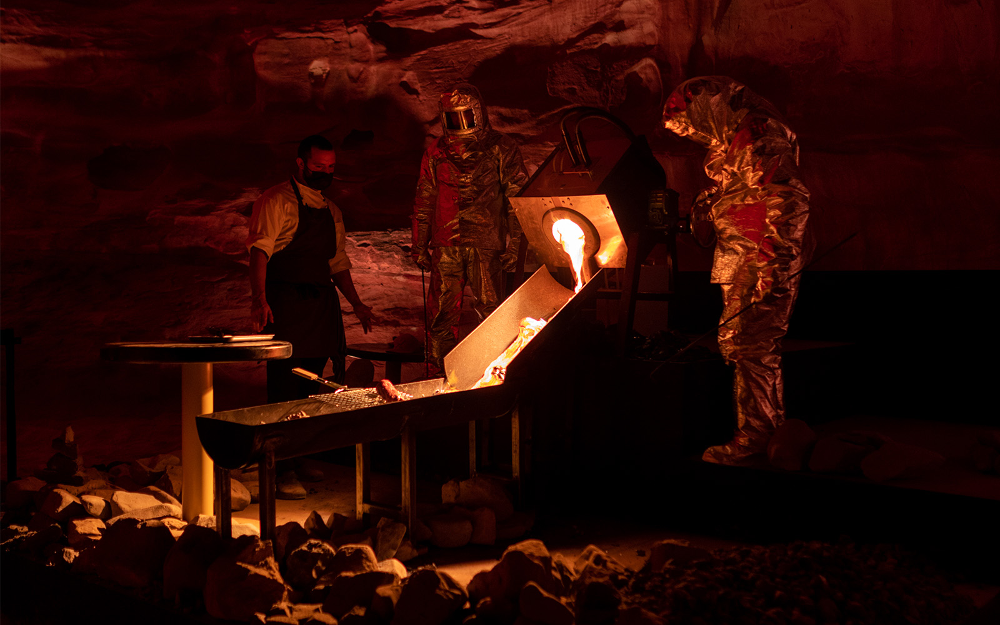
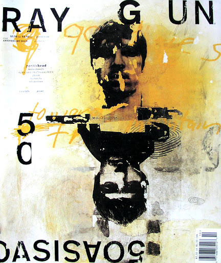
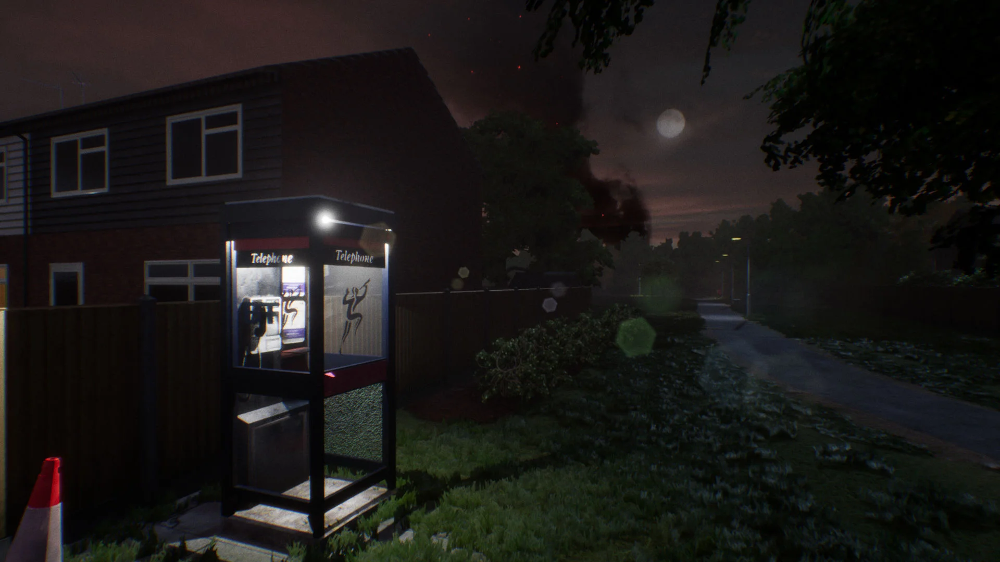
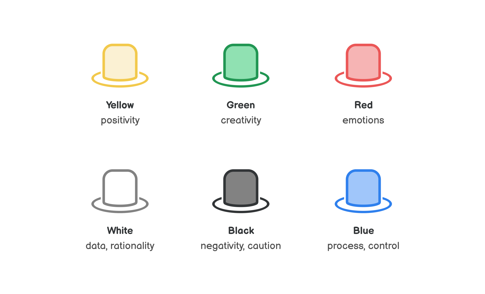
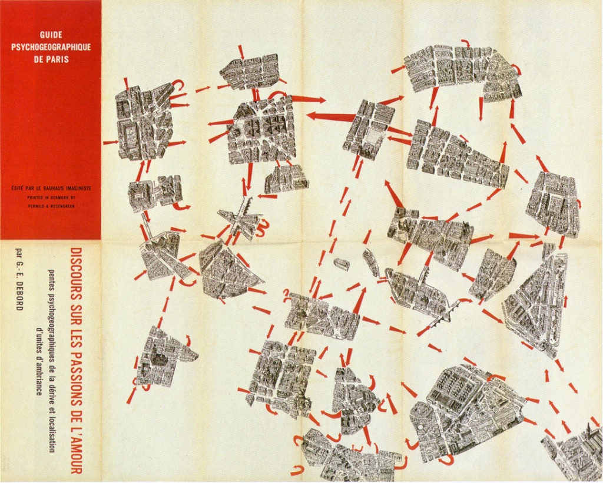
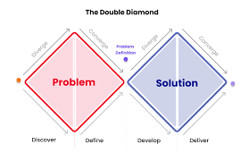
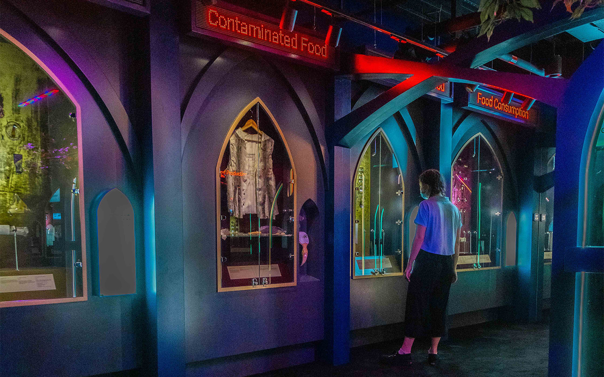
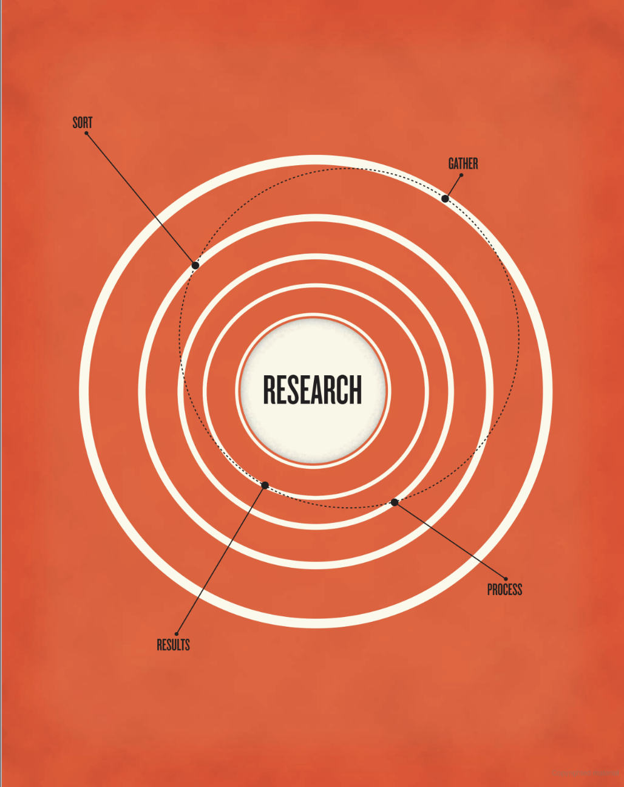

This week, we're moving into the idea development and planning phase of our self-initiated project. During this week's lecture, we explored concepts of idea generation, craft, and how context and contemporary theory can enhance and inform idea generation and project planning. 

I'm really excited about my current project idea - I feel like it's an area of great personal interest for me, and will allow me to experiemnent and embrace risk while also hopefully regaining a genuine love for design. I'm looking forward to developing it further this week. 

## Lecture Reflections

>"Ideas are good. But where do you get them? Some people believe they fly around like radio waves just waiting to be captured by the brain's receiver. Perhaps it is the way some people, those who wear silver foil on their heads, get them. But the majority of us develop ideas from terra firma - or rather quantifiable fact. Even most fiction is built on fact." *Steven Heller, 2013*  

In this week's lecture, the creative practitioners gave insights into their own research and development processes. They answered two key questions - 'How do you visualise and develop your initial ideas?' and 'what are your points of inspiration, theories and reference?'.

Sam Bompas emphasised the importance of research in this week's lecture, stating that *'you can't have a good idea in a vacuum'*, which I completely agree with - To me, research is like the skeleton of a project, and without it, it will often be superficial and meaningless.  As was emphasised in this week's lecture, good research can form a stable, strong foundation for a project. 

Something that really struck me about this week's lecture was how broad and different everyone's processes where, which really got me thinking about how every creative person will have a process which is unique and deeply personal. For example, some practitioners, such as Vince Frost, prefer to sketch out their ideas, whereas others, like Sam Bompas of Bompas and Parr, preferred to write their ideas down. Vince Frost has a very exploratory and intuitive creative process that's very similar to mine which was nice to see - he likes to sketch first until ideas start to flow, and he enjoys hands-on experimentation and play with design software. 

Another area of this week's lecture that really interested me was hearing the pracitioners talk about their points of reference and creative inspiration, and t was interesting to see a couple of practitioners talk about how they enjoyed merging both historical references and modern, contemporary references. For example, Christoff Miller of Offshore Studio said that he was greatly inspired by the neatness of Swiss design, but loved bringing in the disruptive, messier elements of modern, contemporary sculpture. Veronica Fuerte also mentioned that she loved taking inspiration from the modernist style of the 60s and 70s, which she described as a 'good basis', but she tries to bring in modern and contemporary elements that will appeal to multiple demographics. 

I found this really interesting, as this is something that I love to do in my own work, and I personally feel like it's so important to build on points of reference rather than just try to embody them as they are. This was also something that I feel is very relevant to my self-initiated project concept - I feel like a lot of my research this week will possibly be based around the traditional, analogue mediums and techniques of the 70s, 80s and 90s, but integrating modern, digital outlets, elements and concepts.

I loved hearing about Werkflow's wide range of multi-disciplinary inspirations. Game design is such a huge area that encompasses so many different aspects and practises, such as storytelling, music, coding, etc. Because of this, I'm not surprised that there can be so many different points of reference for games. I loved that James Stringer said they he was inspired by social realist cinema, as I feel like the bridge between game and film is so noticeable and very interesting. This got me thinking about how sometiems it's important to look at references that maybe are seemingly unrelated to your field, as interdisciplinary research can bring so many great ideas and make a project really rich and layered. 

I found listening to Werkflow particularly interesting this week. I found it fascinating to hear about how a game is developed from concept to final piece - how the idea started as a script, then turned into a design bible, and then went into development. I was especially interested when James mentioned that he felt that skill gaps and technological setbacks had stopped the team from reaching the full potential of their project, 'Sovereign'. I think with a medium like video games, which is so complex with so many moving parts, it must be hugely difficult to create a final product that maintains the core heart of the initial idea. I feel like this is also relevant to campaign or visual identity development - there are so many moving parts that have to come together as a cohesive whole, but in the end it's all about storytelling, and it's important not to lose the heart of the initial concept or story that you want to tell.

Just as when Sam Bompas emphasised the importance of embracing the individual skills of everyone in a team when he mentioned that everyone has their own way of visualising and noting down their ideas, Christoff Miller made some great points this week about working in a team. He emphasised that everyone's creative process is totally different, and that this should be embraced. Christoff's mention of the 'third mind', a phenomenon that occurs in a team working scenario, reminded me a lot of the 'six thinking hats' analogy that we touched on in Week 5 of GDE710, 'Thoughts on Ideas'. The 'six thinking hats' analogy emphasises the importance of collaborative thinking. As everyone in a team will have a unique, individual set of skills,engaging with others, and in a wider sense, the world around you, will result in a broader, richer project. 

Thinking back again to 'Thoughts on Ideas', I loved what Vince Frost said about how he gathers inspiration. He mentioned that he is always on the lookout for inspiration and that everything can be a source of inspiration. He said that he gathers the majority of his inspiration from the world around him, the city he lives in and the people around him. 

This got me thinking back to the concept of 'looking vs seeing', which we also touched on in GDE710 - looking at the world around you in a deeper way and using that as a means of inspiration. I especially related to what he said about noticing things that frustrate or upset you, and then using them as a launchpad for projects. What Vince said about being particularly inspired by walking and wandering reminded me of the concept of 'Dérive', coined by Guy Deboard and the Situationists, which encourages walking with no aim or purpose other than to take in the world around you, which I personally use as a method of gathering ideas all the time. 

Christoff Miller mentioned that he and his team engage in a range of different research and idea generation methods, such as reading, visual references and physical experimentation. I found it interesting that Christoff mentioned that he found his process quite hard to pin down, which I really identified with - my process can be very sporadic and unpredictable, and I find that often my best projects come from less linear processes, where I let my ideas and intuition take the lead. 

However, even though the creative process is often chaotic and non-linear, there are a lot of research-driven methodologies and processes that are designed to prompt ideas and act as frameworks for project development that are proven to work, as they're often developed by creatives for creatives, such as the Double Diamond model. Overall, though, Christoff said that it's important to stick to what works for you as an individual. 

I really liked what Sam Bompas said this week about not being afraid to get messy when it comes to research and experimentation. Sam mentioned that he's always coming up with ideas and slotting them away for future reference, which I think is a great idea, but that 90% of those ideas are total rubbish and that's okay, and he mentioned that some of his best ideas have come from messy napkin sketches. This was reassuring, as I often feel a bit insecure about the messiness of my own process, but what Sam said showed me how important it is to just get your ideas down, and worry about tightening things up later. I'm a firm believer in Hemingway's quote *'write drunk, edit sober'*.

I found a really great book during my research this week that touched on the importance of research in design - 'Writing and Research for Graphic Designers' by Steven Heller. In this book, Heller discusses the importance of and methods for research as a graphic designer, with many case studies. He says: 

>"Great research is partly police work. You find clues that lead to more clues that lead to a hot trail that leads to conclusive evidence. Often you may instinctively 'feel' something exists somewhere, but finding it is the result of luck and seredipity. (...) Despite that thrill of discovery, having a plan that takes you from point A to point B is useful." *Steven Heller, 2013* 

I think that this really sums up my main take away from this week's lecture - it's okay for idea development, research and experimentation to be messy and non-linear, but you should also make the most of the many methodologies and processes that can keep you on track and help your project development phase to run smoothly, which is especially important when working in a team. To start my research this week, I'd really like to go back to my notes for Week 5 of GDE710, and investigate some of these methods and processes.

## Research and Development Methodologies

This week, we're focusing on the research and development phase of our self-initiated project. It's actually been a good while since I developed a project properly, and, as mentioned by Offshore Studio in this week's lecture, I feel like the ability to really dive deep into research and development is something that can be missed in commercial projects or projects for clients where you're tight for time, so I'm excited to dust of my research skills and really get stuck in to building a solid foundation for this project.

It was suggested this week that we looking back at our work for GDE711, specifically our work for week 7, 'Research and Theory', where we investigated research methodologies that are used frequently by professional artists, designers and makers. Research can be quite an overwhelming concept - it's difficult to know where to start and what to look for. During GDE711, I took a look at a number of research techniques nad methodologies that have helped to narrow this down when working on projects like mine.

Research into research techniques
read the resources, gather quotes
academic thinking 

With some initial research into the concept of research out of the way, I was able to start considering which techniques and methodologies would suit my project. 

My project theme spans psychology, design theory, visual culture, analogue craft, AI critique and feminism, so I came to the conclusion that I'll benefit from using a mixed-method research approach. Based on this, I conducted some further research, and gathered some relevant methodologies that I could apply to this project.

## Defining my research direction

Revisit your research questions (you already have great ones!).

Write 3–5 sub-questions for each (What does authenticity look like? What does imperfection feel like?).

Set up a Notion or folder structure for:

contextual research

visual references

primary research

experiments

reflective notes

### Contextual Research (Theoretical/Cultural Research)

Contextual + thematic research:

Look into:
authenticity in digital culture

AI aesthetics

psychology of filters

analogue craft revival

anti-perfection movements

Write down 3–5 key insights per article, book, or video.

Contextual research involves exploring the wider cultural, social, psychological and historical factors that shape a design problem. Rather than looking at visuals alone, contextual research examines the ideas, behaviours and systems that influence how audiences think and feel. 

This kind of research is widely used by design professionals because it adds depth and relevance to creative work - it ensures that design decisions are informed, intentional and responsive to real-world issues, rather than being based only on instinct or aesthetics. By understanding the context surrounding my project's theme, I'll be able to identify meaningful insights, uncover underlying tensions, and create solutions that resonate on an emotional and cultural level. It's essential, as it will give my project meaning and rationale.

For this project, contextual research is particularly valuable, as Detox deals with complex topics such as digital perfectionism, authenticity, body image, and the impact of AI. Investigating the cultural history of imperfection, the psychology of filters, and the social pressures shaping online identity will help me to establish a strong conceptual foundation for the project's visual direction, ensuring the final campaign is not only visually compelling but also socially aware, empathetic and grounded in contemporary discourse.

I feel like it's really important to ground my project in established psychological and social research, so start my contextual research, I took a look at some online articles which discuss the psychology of filters, authenticiy and identity online, as well as some academic papers which discuss the harmful effects of exposure to online concepts of 'perfection' on young people today. 

Within this project, something that's really relevant and important for me to understand is why people filter themselves, and how that impacts self-perception and authenticity. Personally, I use Instagram filters a lot, and I wouldn't dare to go live or post a photo without editing it first. Just in the same way that wouldn't leave the house these days without makeup. I feel like for me, low self esteem abdolutely plays a role, but it's also a lot to do with perfectionism - I feel like beauty standards for young women are so high these days, that there's a certain social stugma that comes with not adhering to that. 

Regardless of my personal thoughts and feelings on the topic, I needed to look into the wider phsycology of why and how social media has perpetuated the need for constant perfection. Ifound a really fascinating and recent article by Calogero Lo Destro from Frontiers in Psychology titled: *Unraveling the impact of self-esteem on the utilization of Instagram filters: the mediating role of fear of negative evaluation.* In this article, Lo Destro conducts a study which shows that people with lower self-esteem are more likely to use Instagram beautification filters, and this behavior is mediated by fear of being judged. 

This article was a really pivotal point in my contextual research, as it supports my argument that digital perfection (via filters or curated identities) causes real psychological harm. Also, Lo Destro's quantitative survey into self-esteem, FOMO and social comparison is something that I could and would like to take inspiration from further down the line this week, as I'd love to conduct my own primary, survey-based research. When I come to do my own survey or interviews, I could base some of my questions on the findings from these studies 

Another article, "The Online Authenticity Paradox: What Being “Authentic” on Social Media Means, and Barriers to Achieving It" by Oliver L. Haimson, Tianxio Liu, Ben Zefeng Zhang and Shanley Corvite, students at the University of Michigan, gave some really fascinating insights into the concept of online 'authenticity'. Through interviews, this article explores how people define “authenticity” online. It shows that many feel unable to present a fully authentic self because of the pressures to curate.  

This article's insights, particularly the interview notes, was extremely useful for and relevant to my project's reflection on realness vs a polished, idealised self. Just as in the previous article, this article also backs up E. Tory Higgin's 'Self Discrepency Theory', showing through a series of interviews that the stronger the divide between a person's 'real self' and their 'idealised self', the lower their self-esteem and the lower their mood. 

It's interesting to me that a lot of young people seem to have a focus on their 'ideal self'. The 'That Girl' trend links to this - you don't want to be you, you want to be 'that girl'. You want people to refer to you as 'that girl', you want social approval. The message of clean eating, getting up at 5am and doing pilates isn't anything to do with your personal growth or health, it's all posturing for others and therefore very toxic. 

This article also gave me a hypothesis of my own - people who are comfortable posting themselves online often already have a high self esteem, and this is often due to being judged as having a higher level of phsyical attractiveness by others - in short, the majority of people who post themselves online, and especially those who go on to gain a huge following, are good looking to begin with. This creates an echo chamber where the only people that young people are seeing online are attractive or physically 'perfect', and they therefore begin to think that this is the norm. It also creates FOMO - a young person might have a lot to say, content ideas, or something to share, but be nervous to do so because they don't fit the standard that they feel is required. I feel like it's important for me to really push the message that your voice deserves to be heard in my project. 

This was backed up by the article “Inauthentic Online Self” paper to justify why Detox needs to celebrate the natural, imperfect self as more “real.”

Gather academic sources on body image, digital toxicity, media theory.

In my Figjam file, I pulled a lot of quotes or statistics from these articles that could be used for visual or campaign messaging (posters or for the zine). Here are some of the key quotes I pulled:  

Next, I took a deeper look at some of the design movements that I identified as relevant to my project last week: Fluxus, Punk, Dada, post-digital design.

Looking back at the concept of 'medium as message', I feel like mixed media is the right medium for this project, as it directly links to themes of anti-perfection, authenticity and the importance of being human. The most common contextual ideology that I wanted to research is the one that pushed me to want to investigate this project - the current rise of “anti-AI aesthetics” or the handmade revival. Recently, I've seen a lot of graphic designers, artists and illustrators who I look up to embracing the use of mixed media, both as an aesthetic choice, and as a way of pushing back again the insurgence of homogenous, slick digital design that can be so easily replicated by AI.

Sara Sun: 

https://www.tiktok.com/@sara.and.misc/video/7527442947785215239

Perfectly Imperfect Newsletter 

https://www.pi.fyi/welcome
https://www.tiktok.com/@thezlink/video/7303506301420588320

https://www.jasminedowling.com/
https://www.nickgentry.com/ - reminds me of Nam June Paik
https://www.itsnicethat.com/articles/pavel-ripley-art-graphic-design-discover-220425 - process over outcome
https://www.itsnicethat.com/articles/juri-okita-wabi-project-graphic-design-food-drink-040523
https://www.instagram.com/allan.bealy/?hl=en
https://dtan.studio/
https://www.itsnicethat.com/articles/dtan-studio-graphic-design-discover-230725
https://blog.adobe.com/en/publish/2024/01/30/how-to-be-an-analog-designer-in-a-digital-world?utm_source=chatgpt.com
https://www.itsnicethat.com/articles/andrzej-g-graphic-design-discover-010725
https://www.itsnicethat.com/articles/kartik-tuli-graphic-design-discover-010524
https://www.itsnicethat.com/articles/anna-gibson-discover-graphic-design-100823
https://www.itsnicethat.com/articles/pfa-typefaces-graphic-design-250522

These creators physically resist digital perfection through craft (risograph, collage, hand-lettering, old tech) — exactly what your project is about.

They blend analogue materials with contemporary identity, showing that craft isn’t nostalgia: it’s a critique and a choice.

Their work is highly visible on social media, so you can draw both inspiration and insight into how people engage with authenticity — which can inform your campaign direction, your tone, and your process.

the dove campaign 

### Visual Research (Primary + Secondary Visual Analysis)

Purpose: Build reference points that support your visual direction.

Analyse analogue-heavy designers (Corita Kent, Carson, Reid, Paula Scher early works).

Look at contemporary anti-digital artists (Signe Pierce, Ashley Armitage, Johanna Hedva’s tech critique).

Look at craft-based practices (risograph studios, zine culture, “ugly design” trends, anti-UX aesthetic).

This becomes the backbone of your mood board.

### Primary Qualitative Research

## Primary Research

Make a simple survey (Google Forms).

Ask 8–10 targeted questions.

Share to friends/peers.

Optional: one short interview.

Screenshot filter-heavy ads for visual research.

Purpose: Understand your audience emotionally and directly.

Create a short survey asking women/creatives:
how filters affect self-image
how they feel about AI replacing creatives
whether analogue visuals feel more “honest” or “human” to them

Conduct 2–3 short interviews (friends, peers, creatives).

Collect real quotes to use in your zine or campaign.

Tutors love when these insights feed into your messaging and visuals.

### Observational Research
Purpose: Study visual culture as it appears in the wild.

How to apply:
Screenshot TikTok/Instagram filters, AI beauty ads, overly polished branding.

Observe patterns:

repetition of face shapes

algorithmic sameness in influencer feeds

smoothing, perfection, idealisation

These can be integrated into your collage or digital zine.

the dove campaign

### Quantitative Research
Purpose: Give statistical weight to your argument.

Find existing data:

% of young women affected by filters

stats on digital burnout

stats on the rise of AI-generated content

stats on authenticity trends (e.g., de-influencing)

How to apply:
Use survey data: What % feel pressured by AI beauty aesthetics?

This becomes fuel for posters or campaign messages.

### Material-led / Practice-led Research (Play as Methodology)

## Practise led Experiments

Spend 1–2 hours playing.
 Try:
scanning ripped paper

photocopy degradation

layering collage

inky hand lettering

analogue textures

printing and rescanning images

camera roll screenshots of overpolished content

These experiments don’t need to “be good” — they are research.

This is the methodology you used in GDE711, and it is perfect for Detox.

Bringing “Play” Back Into Research

You absolutely should bring your GDE711 work into this project.
Ask yourself:
What does analogue play reveal emotionally?

How does physical mess reflect digital overstimulation?

Are accidents more honest than AI precision?

You can even create a mini-series of Play Experiments:
messy collage

scanner dragging

smudged hand-lettered phrases

overprinted risograph layers

photocopy distortion

analogue shapes layered over hyper-smooth AI images

Then photograph, scan, and annotate these with short reflective notes.
Purpose: Let making become research.

Try photocopy distortion, scanning textures, layering messy collage.

Record what each method feels like emotionally.

Let accidents, messes and errors become data.

Play with:

ripped paper

hand lettering

smudges, paint, ink

scanner glitches

risograph overprinting

stop-motion texture studies

Your visual experiments are research — this is academically valid.

### Autoethnographic / Reflective Research
Purpose: Use your own experiences as valid design data.

How to apply:
Reflect on your own relationship with filters, perfectionism, burnout, AI.

Document your feelings during making:

“When I smudged the ink, it echoed the loss of control caused by curated social media identities.”

This directly supports the “authenticity” ethos of the project.

### Critical Design Research
Purpose: Treat design as a tool for critique or protest.

How to apply:
Ask: how can a visual act (a glitch, a rip, a smudge) communicate resistance?

How can imperfection protest AI’s smoothness?

This shapes the tone of the whole campaign: rebellious, reflective, honest.

## Research Task

Your research task this week is to develop a mood board to help clarify the themes that you will be exploring in your self-initiated project

Before starting the moodboard, gathered some references: 

1. Movements
Fluxus (mess, play, instructions, participation)

Dada (anti-perfection, collage, subversion)

Punk Graphics (Jamie Reid)

New Wave / Postmodern Typographic Messiness (April Greiman)

Post-Digital Design (digital imperfections, glitches)

Zine culture (DIY authenticity)

Risograph / Printmaking (inherent imperfections)

2. Designers/Artists
Corita Kent — playful, analogue, spiritual imperfection

David Carson — anti-grid, emotional typography

Paula Scher (early work) — expressive type

Elle Luna — hand-painted textures

Man Ray photograms

Barbarian Group / post-digital glitch artists

Signe Pierce (critique of beauty & Instagram hyperreality)

Jenny Holzer (text-as-protest)

Martine Syms (identity & digital culture)

3. Contemporary Cultural References

“De-influencing” trend

#nofilter movement

Anti-AI/anti-homogenisation discourse

Gen Z authenticity aesthetic

Anti-aesthetic TikToks (chaotic low-effort formats becoming trendy)

Pinterest: “messy collage”, “analogue textures”, “tactile typography”

## Developing the Mood Board

Organise:
visual references

emotional colour palette

textures & analogue marks

quotes from surveys

cultural references

design precedents

your experiments

screenshots from digital culture

Place them together on A3 (or Miro/Figma) and let themes emerge.

Label each section:

“Imperfection as resistance”

“Body image & distortion”

“Analogue craft”

“AI hyper-smoothness”

“Emotional honesty”

This becomes the conceptual spine of Detox.

## Next Steps
- Plan for Week 02…

## References

