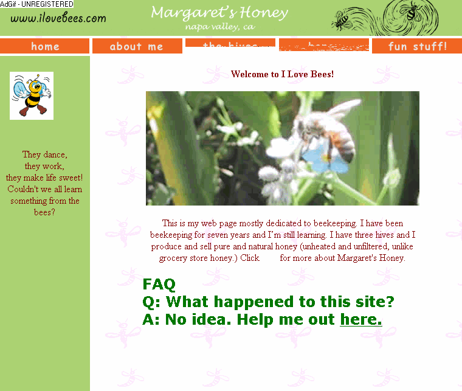
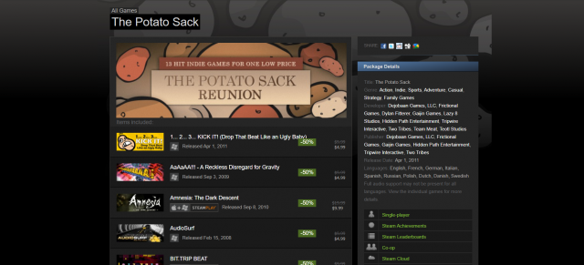
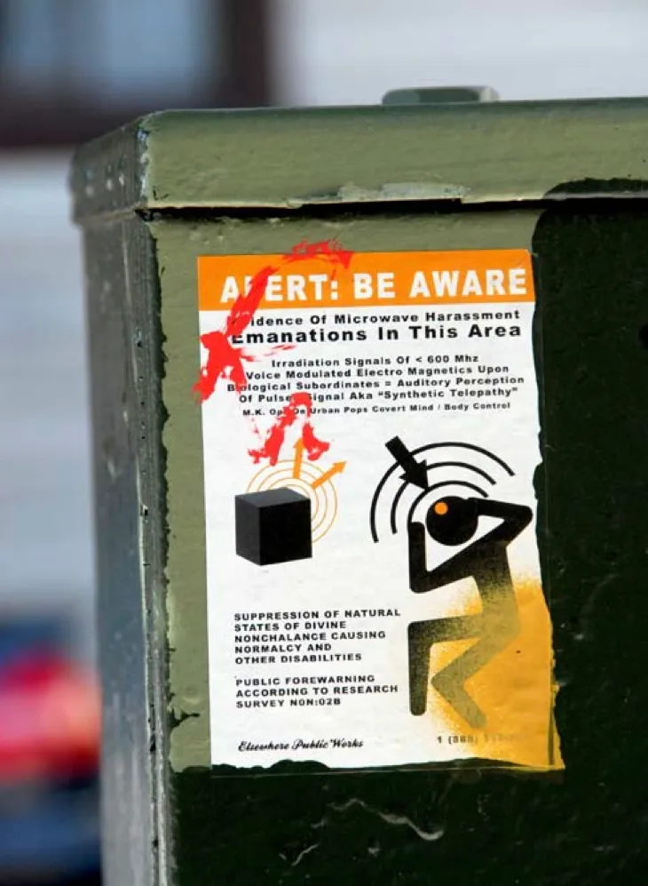
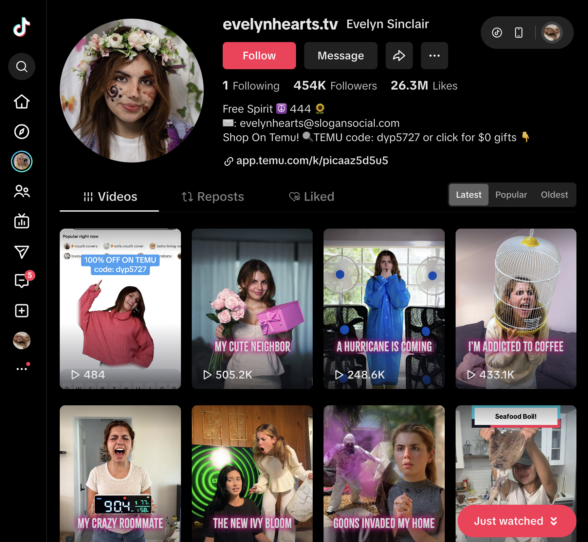
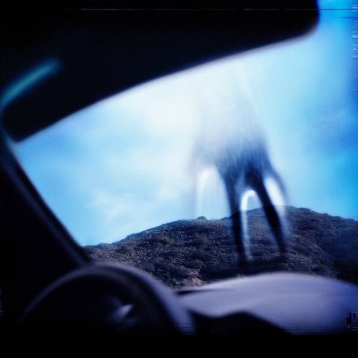
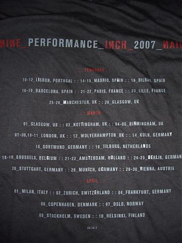

This week, we're starting the second brief of this module, 'Industry Set', where we will work on a live industry brief as opposed to a personal project.

I'm really excited to get started with this project. (talk about self initiated and how you felt). For this brief, we've been tasked with creating a design intervention for the National Gallery London. When I first took a look at the brief for this project, I was a little overwhelmed, but I'm looking forward to really getting into the gallery's history this week and doing some deep research in order to find a direction to move forward with. 

After the first brief's deeply personal outcome, I'm looking forward to taking the opportunity to step back into collaborative, commercial work. I started this week by listening to the industry practitioners give insights during this week's lecture, which was all how professional designers research and identify new industry projects or opportunities to participate in, which really helped when it came to choosing a brief to move forward with. 

## Lecture Reflections

> “Choose a job you love, and you will never have to work a day in your life." *Confucius*

This week marked the beginning of the 'Industry Set' brief, a project that shifts our focus from self-initiated exploration to live, client-led collaboration. This week's lecture offered invaluable insights into how creative professionals identify, evaluate, and pursue new industry opportunities. Hearing from Torsten Posselt (FELD), Matthew Jones and Michelle Dona (Accept and Proceed), Wouter Dirks (Studio Dumbar), and Stijn van de Ven and Luke Veerman (Eden Spiekermann) gave a nuanced view of what it means to align one’s creative practice with professional goals.

What stood out to me most in this week's lecture was the balance between personal authenticity and professional adaptability. Torsten Posselt reminded me that while it’s natural to gravitate toward projects that align with personal interests, there’s great value in stepping outside of our comfort zones. He described how choosing projects without an immediate emotional connection can open up new ways of thinking, introducing play, curiosity, and experimentation into the process. I found this liberating — it challenged my instinct to only pursue projects that “fit” my established interests. It made me realise that growth often happens when we enter unfamiliar territory and let ourselves respond intuitively to something new.

Matthew Jones and Michelle Dona from Accept and Proceed offered a slightly different perspective, one that emphasised intentionality. They spoke about knowing who you are as a designer, defining your criteria for the types of projects you want to take on, and being deliberate about the clients you attract. Their advice to “develop self-initiated projects in your niche to attract clients that align with it” particularly resonated with me. It made me think about how personal work can act as a magnet — by showcasing what we care about, we attract others who value the same things. I can see this being especially relevant as I begin developing my professional identity and portfolio beyond my the course.

Wouter Dirks from Studio Dumbar highlighted the importance of networking and allowing opportunities to grow organically. His view that “as you develop, clients will come to you” reframed how I think about visibility. Rather than chasing every opportunity, it’s about consistency, credibility, and building relationships within a community. It’s a slower but more sustainable approach, one that prioritises connection over competition.

The practitioners from Eden Spiekermann, Stijn van de Ven and Luke Veerman, gave a particularly grounded take on professional growth. Stijn’s advice to *“find problems you want to solve and topics that resonate with you”* really struck a chord. It echoed something I’ve been realising through my own projects: that passion fuels perseverance. When you care deeply about a subject, the work becomes more meaningful and you’re far more likely to see it through. However, he also emphasised the importance of being honest about your abilities — recognising when to push yourself and when to rely on your strengths. This was a valuable reminder that while risk and experimentation are vital in self-initiated work, client projects demand reliability and responsibility.

Luke Veerman expanded on this by discussing the benefits of specialisation. He suggested that focusing on one niche allows designers to build authority, confidence, and transferable skills, positioning them as experts in that space. I found his words thought-provoking, especially when he linked this idea to lifelong learning. The idea that “you are never finished developing.” It reminded me that mastery doesn’t mean stagnation; rather, it’s an ongoing process of refining, evolving, and continuously learning.

Overall, this week’s lecture made me reflect on the importance of balance — between personal growth and professional focus, between curiosity and competence. It’s encouraged me to think more strategically about the types of projects I take on, both in terms of what excites me creatively and what will help me develop professionally.

As I prepare to select a brief for the Industry Set project, I plan to carry these insights forward by:
– Choosing a project that challenges me while still aligning with my values and skill set.
– Reflecting on what kind of designer I want to become, and what types of clients I want to attract.
– Using this project as an opportunity to practice professionalism, adaptability, and self-direction.

I think this week really reinforced that finding your place in the industry isn’t about waiting for the “perfect” project — it’s about defining who you are, staying curious, and remaining open to the opportunities that help you grow.

## Further Research

## Webinar Notes

This week's webinar was super helpful when it came to unpacking and contextualising the brief. Teresa provided some super useful examples of how we could approach this project, as well as some examples of real world projects that could hypothetically work as strong outcomes for this brief.

Teresa reccomended that we really get into the gallery and it's paintings before getting started with our research, which is definitely where I'll start with my research this week. She also reccomended that we really engage with every detail of the artwork, and consider not just the work, but the contextual details that surround it. 

During this webinar, Teresa encouraged us to see things through our own lens, and be willing to challenge convention. I was really struck by the brief's emphasis on 'engaging diverse publics', and I think that this is so important - I think a lot of people feel disconnected from art and culture, be that because of accessbility issues, language barriers or because they feel disconnected from the collection which has been curated under a white male gaze. I'd really love to look deeper into the collection, and find connections that challenge these restrictions and invite people who may be marginalised to enjoy what it has to offer. 

In regards to the issues of accessibility, I loved how projects like Vocal Eyes are creating solutions that allow blind and visually impaired people to experience art galleries. I feel like this is areally great example of a project which examines and rethinks the gallery's collection to open up the gallery to new audiences.  

Teresa used Taylor Swift as an example of what could be considered a successful outcome for this brief. She discussed how Swift's new song 'Life of Ophelia' from her album 'The Life of a Showgirl' has driven an immense amount of traffic to the Museum Wiesbaden in Germany, which houses Friedrich Heyser's 'Ophelia' painting, as hundreds of her young fans travelled to Germany to see the painting in person. I feel like this is another great example of driving interest in a group who perhaps wouldn't typically be interested in fine art or art history. Swift's music video really inspired me, and got me thinking about how I could perhaps find one particular painting that spoke to me and create a project or experience that told it's story and piqued people's interest, ans it got me thinking about how carefully considering your target audience and reframing the collection in a way that appeals to them can influence them to gain an interest. 

I loved what Teresa said about how people spend longer reading the plaque than the painting, and I thought that was absolutely fascinating - it got me thinking about how important context is in galleries, especially to visitors who aren't familiar with art history or British history in general. It also got me thinking about how much power this gives the gallery curators - the plaque is written from their perspective, through their lens, and while I think the National Gallery's plaques and captions are impartial and unbiased, it also leaves room for one perspective when  everyone's subjective interpretation of the piecem might be different. 

I loved Teresa's fanfiction idea, and what she said about considering the current 'cultural zeitgiest' when developing our project really inspired me. Teresa said that if she was approaching this project, she would take inspiration from the current mainstream interest in 'fanfiction’, and, inspired by Alexander McCall Smith’s book ‘Unexpected Love Stories’, she would create a club/movement that encouraged people, especially young people, to look at the paintings with no context or prior knowledge, and write stories based on their interpretation of the painting, using their imagination, which I thought was such a cool idea and one that really challenges the notion of using captions for context. 

This got me thinking about what in the current 'cultural zeitgiest' reall inspires me. Something that is very trendy at the moment online is the idea of 'unfiction' or 'ARGS' (Alternate Reality Games).

**Unfiction** is a form of storytelling that presents fictional narratives as if they are real, often blurring the boundaries between everyday digital life and narrative play. Unlike traditional fiction, unfiction doesn’t announce itself as a story — instead, it unfolds through websites, emails, social media accounts, hidden clues, or “found” documents, encouraging audiences to participate and piece together meaning. It relies on immersion, subtle worldbuilding, and the thrill of discovery, making the audience feel like investigators uncovering something they were not meant to see.

**ARGs (Alternate Reality Games)** are an interactive, puzzle-based form of unfiction that use real-world platforms to tell nonlinear stories. ARGs often involve hidden messages, codes, clues, and narrative “glitches” embedded in websites, videos, or social posts. Players collaboratively solve mysteries, follow characters, and uncover deeper layers of a narrative. ARGs are characterised by the concept of “This Is Not a Game” — meaning the story is meant to feel like it exists alongside real life, not in a separate fictional world.

The two terms often overlap - many ARGs are unfiction, but not all unfiction are ARGs. Some popular ARGs include 'I Love Bees' - one of the most famous ARGs ever, 'I Love Bees' was created to promote Halo 2. Players discovered a 'hacked' beekeeping website, followed clues, answered payphone calls, and unlocked audio logs. 'I Love Bees' was a deeply immersive story that blurred fiction and reality, as players had to collaborate and hunt for real-world clues. 

Another great example is 'Potato Sack', an ARG by Valve and other game developers to promote Portal 2. Players solved puzzles embedded in thirteen different indie games, demonstrating how ARGs can run across different platforms and games, pulling together diverse communities.

But it's not just video games that ARGs are used to promote, many companies, businesses have used unfiction ARGs to promote their products and services. ARGs have also been used to promote films, art exhibitions, albums and books, but they always used for promotional purposes, sometimes they're started just for fun, becoming an art form of their own. 

They're also not always entirely online based - 'Games of Nonchalance' was a real-world, city-based unfiction project where participants in San Francisco followed clues, explored installations, received emails / phone messages to uncover a secret organization. 'Games of Nonchalance' was the perfect model for immersive, location-based storytelling and the concept of hidden worlds in real life. I absolutely love this ARG for the way it tells a story - the creator of this ARG really could have just written a book, but drip-feeding the story to the unsuspecting public through clues and hidden messages in a way that makes them feel like they're direcly involved is so much fun. 

Because of the medium's inherent secrecy and intrugie, many ARGs are horror based, or bring in elements of horror to build suspense and a surge of adrenaline for the players. 

ARGs and Unfiction have become so prevalent and popular now that platforms like Tiktok, Instagram and Youtube are absolutely filled with them, in the form of mysterious, often eerie accounts posting supposedly real and candid content full of hidden secrets. 

The internet's love for ARGs got so intense that when Youtuber Marina Joyce began to struggle with her mental health in 2016, she began posting content that her viewers deemed 'unusual', and many viewers suspected that she was trying to start an ARG and began scouring her videos for clues. 

One of my all time favourite ARGs is Nine Inch Nails' 'Year Zero' ARG, one of the most ambitious and influential unfiction projects ever created by a music artist. 

Designed to accompany Nine Inch Nails’ 2007 concept album 'Year Zero', the ARG unfolded as a dystopian treasure hunt across the real world and the internet. It began when fans discovered a hidden URL printed on the back of a NIN tour T-shirt — a tiny clue that opened the door to a sprawling network of cryptic websites, propaganda materials, and in-universe government documents.

As the ARG progressed, players uncovered USB drives secretly planted in bathroom stalls at NIN concerts, each containing unreleased tracks and hidden spectrogram images that revealed in-story messages when analysed. Phone numbers embedded in audio glitches led fans to automated hotlines from fictional underground resistance groups. 

Nine Inch Nails leaned right into the horror potential of ARGs - one hidden phone number played audio of a 'wiretapped' phone call from a distressed woman tragically caught in the midst of a club stabbing, which scared many unsuspecting listeners. In 2008, shortly after the ARG had begun, a confused Youtuber accidentally called the fake number and couldn't make sense of what they were listening to - in a video titled '216-333-1810...wtf !!' they posted what they heard after calling the number. The video can be found below **(the phone call is fake, but please be aware that it's quite distressing.)**

<figure class="video-figure">
<video controls width="100%">
  <source src="/videos/216.mp4" type="video/mp4">
  Your browser does not support the video tag.
</video>
<figcaption>A fictional 'wiretapped' phone call from Nine Inch Nail's 'Year Zero' ARG</figcaption>
</figure>

Across dozens of interconnected websites, players decoded government memos, dossiers, and surveillance records that slowly revealed the album’s narrative world: a near-future America sliding into theocracy, environmental collapse, and authoritarian control.

The project drip-fed information over months, deliberately blurring the line between fandom, activism, and storytelling. What made Year Zero groundbreaking was how it used the mechanics of discovery - found objects, hacked websites, hidden numbers, and audio clues, to make fans feel like co-investigators in a living, breathing dystopia. 

Instead of simply promoting the album, Year Zero extended the album's world-building into a participatory, cross-media narrative that felt secretive, political, and deeply immersive. It remains a landmark example of how artists can use ARG structures to create cultural worlds that exist far beyond traditional media.

This week's webinar got me thinking about how much potential ARGs have when it comes to marketing and storytelling. If I had to pick one thing from the current 'cultural zeitgeist' that I'd I'd love to integrate into this project, I think the concept of ARG or unfiction could be a really effective medium, especially if I chose a thematically disruptive intervention. 

After this week's webinar, I wanted to start narrowing down the direction I'd like to take for this project. I made a list of  current interests and skills I have that I think it could be interesting to explore here, and I narrowed that list down to:

- Storytelling
- Web (UI/UX, coding, programming)
- Illustration

I also considered my current cultural interests: 

- 'Unfiction' and ARGs
- Graphic novels 
- Webcomics 

This gave me a fairly solid foundation to start considering the direction I'd like to take with this project. My next step this week will be to take a massive deep dive into the gallery's collection, to start to uncover a theme that I'd like to explore. 

## Research Task

Our research task this week was to carefully read, analyse and reflect upon the ‘Industry Set’ project brief, and to carefully consider the problem/insight that we might identify and the theme we'd like to work with. The brief is quite broad, which mis very exciting and means that we can really identify a direction that resonates with us, so I'm aiming to find a focus that will be fulfilling for me, as well as successfully meets the brief. 

We were also asked to consider the benefits and drawbacks that our ideas might offer, and the main hurdles that they might present us with creatively. I'm looking forward to getting started with this project, as I'm excited to explore areas of my professional practise that are more commercial than those I'd explored in the last brief. For me, collaboration will always be a huge part of my practise, whether I continue to freelance, or end up working in-house with an agency or business, so I'm always keen to hone my skills in following a brief and actioning external feedback. 

The first thing I did was to take a long look at the museum website, and really get stuck into the collection. I was really blown away by the range of the artwork, and 

https://www.nationalgallery.org.uk/paintings/vincent-van-gogh-sunflowers - mental health, fascinated by him and his unique style of painting 
The way that he died probably feeling like as failure
The mystery of his death
Just so sad
Probably a lot of people who relate to his struggles

https://www.nationalgallery.org.uk/paintings/francisco-de-goya-a-picnic - the black paintings, mental health

https://www.nationalgallery.org.uk/paintings/henri-de-toulouse-lautrec-woman-seated-in-a-garden - love lautrec

https://www.nationalgallery.org.uk/paintings/paul-delaroche-the-execution-of-lady-jane-grey - hidden women? 
such a harrowing image
the treatment of women through history 
violence in history 
https://www.nationalgallery.org.uk/paintings/salvator-rosa-witches-at-their-incantations - hateful propaganda, witches Lots of religious imagery - religious persecution? Witches?
https://www.nationalgallery.org.uk/paintings/andrea-mantegna-samson-and-delilah - more misogyny. 

https://www.nationalgallery.org.uk/paintings/italian-a-man-and-his-wife - not ‘a man and a woman’, ‘a man and HIS wife’.

https://www.nationalgallery.org.uk/paintings/diego-velazquez-the-toilet-of-venus-the-rokeby-venus 
https://www.nationalgallery.org.uk/paintings/hilaire-germain-edgar-degas-peasant-girls-bathing-in-the-sea-at-dusk 
female sex and sexuality, the concept of the female nude 
how recurring it was 
the commodification of the female body by male painters
The irony of pushing innocence, purity and ‘virginity’ on women while taking any excuse to depict a female nude. 
The female body and the male gaze
https://www.nationalgallery.org.uk/paintings/orazio-gentileschi-the-rest-on-the-flight-into-egypt - really struck by this image
The power of the female body, yet it’s commodified in such a tacky way by men
https://www.nationalgallery.org.uk/paintings/carlo-crivelli-the-immaculate-conception - meanwhile this. 
https://www.nationalgallery.org.uk/paintings/peter-paul-rubens-the-rape-of-the-sabine-women - to me, there’s absolutely nothing ‘erotic’ about this image. It’s horrifying. 

the woman as an object - ways of seeing by john berger
https://www.nationalgallery.org.uk/paintings/italian-north-woman-at-a-window - women as subjects, never painters
https://www.nationalgallery.org.uk/paintings/gustav-klimt-portrait-of-hermine-gallia - Gustav klimt
https://www.nationalgallery.org.uk/paintings/jan-de-braij-portrait-of-anna-westerbaen - this woman, described as ‘stern’, 
The stories of women depicted in these paintings 
Give them personalities, make them human

https://www.nationalgallery.org.uk/paintings/hilaire-germain-edgar-degas-miss-la-la-at-the-cirque-fernando - interesting topic

https://www.nationalgallery.org.uk/paintings/edouard-manet-eva-gonzales - female painters
https://www.nationalgallery.org.uk/paintings/women-in-our-collection 
https://www.nationalgallery.org.uk/paintings/artemisia-gentileschi
https://www.nationalgallery.org.uk/exhibitions/past/artemisia/five-heroines-by-artemisia
https://www.nationalgallery.org.uk/stories/women-at-the-national-gallery-victorian-housemaids 
https://www.nationalgallery.org.uk/stories/women-at-the-national-gallery-new-jobs-for-women 
https://www.nationalgallery.org.uk/stories/women-at-the-national-gallery-lena-laurie 
https://www.nationalgallery.org.uk/paintings/elisabeth-louise-vigee-le-brun-alexandrine-emilie-brongniart - one of the only female artists

https://www.nationalgallery.org.uk/paintings/pompeo-girolamo-batoni-time-orders-old-age-to-destroy-beauty - aging

https://www.nationalgallery.org.uk/paintings/quinten-massys-an-old-woman-the-ugly-duchess - concepts of beauty, satire?

https://www.nationalgallery.org.uk/paintings/sebastiano-del-piombo-judith-or-salome https://www.nationalgallery.org.uk/paintings/master-of-the-mansi-magdalen-judith-and-the-infant-hercules  - judith and holofernes! A great story 

https://www.nationalgallery.org.uk/paintings/sandro-botticelli-venus-and-mars 
"This picture was probably ordered to celebrate a marriage, and the unusual shape suggests it was a spalliera, a panel set into the wall of a room. These panels were ordered to decorate the semi-public reception room known as a camera (a sort of bedchamber)."
the info about the frames has gotten me thinking about the settings, where they were hung and where they’ve been etc. 

https://www.nationalgallery.org.uk/paintings/justus-of-ghent-and-workshop-music
loved the concept of this painting

https://www.nationalgallery.org.uk/paintings/pieter-codde-portrait-of-a-man-a-woman-and-a-boy-in-a-room https://www.nationalgallery.org.uk/paintings/jacob-ochtervelt-two-women-and-a-man-making-music
- the candid nature of this picture, how paintings have been replaced by photographs - instagram? Tiktok? Moving image? 

https://www.nationalgallery.org.uk/paintings/carlo-crivelli-saint-john-the-baptist - just think this is beautiful and fascinating

https://www.nationalgallery.org.uk/paintings/michael-sweerts-feeding-the-hungry  - poverty

https://www.nationalgallery.org.uk/paintings/gustave-moreau-saint-george-and-the-dragon 
https://www.nationalgallery.org.uk/paintings/french-a-struggle-in-a-desert
https://www.nationalgallery.org.uk/paintings/ludovico-carracci-susannah-and-the-elders - interesting story, gross in so many ways
- the st george flag, reform, racism

https://www.nationalgallery.org.uk/paintings/francesco-hayez-susanna-at-her-bath - sexual harassment and the persecution of women

https://www.nationalgallery.org.uk/paintings/michael-sweerts-feeding-the-hungry  - poverty
https://www.nationalgallery.org.uk/paintings/henri-rousseau-portrait-of-joseph-brummer, https://www.nationalgallery.org.uk/paintings/georges-seurat-clothes-on-the-grass-study-for-bathers-at-asnieres https://www.nationalgallery.org.uk/paintings/paul-cezanne-in-the-bibemus-quarry 
https://www.nationalgallery.org.uk/paintings/claude-monet-woman-seated-on-a-bench  
https://www.nationalgallery.org.uk/paintings/henri-matisse-portrait-of-greta-moll https://www.nationalgallery.org.uk/paintings/spinello-aretino-decorative-border-with-a-seraph-and-saint-catherine
https://www.nationalgallery.org.uk/paintings/max-pechstein-portrait-of-charlotte-cuhrt 
https://www.nationalgallery.org.uk/paintings/dalmatian-venetian-helsinus-saved-from-a-shipwreck-a-french-canon-drowned 
- interesting technique, stood out to me, the ‘naive’ style of illustration, maybe a platform where people can replicate techniques? 
the insurgence of modern art and 'naive' illustration styles
contemporary art 

https://www.nationalgallery.org.uk/paintings/sassetta-saint-francis-renounces-his-earthly-father - fascinating palette, almost surrealist

https://www.nationalgallery.org.uk/paintings/georges-seurat-bathers-at-asnieres - so modern looking 

https://www.nationalgallery.org.uk/paintings/pablo-picasso-fruit-dish-bottle-and-violin - YESSSS like a breath of fresh air, so cool and visually interesting 

https://www.nationalgallery.org.uk/paintings/adolphe-monticelli-meeting-place-of-the-hunt - amazing art style

https://www.nationalgallery.org.uk/paintings/samuel-van-hoogstraten-a-peepshow-with-views-of-the-interior-of-a-dutch-house - very cool 

https://www.nationalgallery.org.uk/paintings/odilon-redon-ophelia-among-the-flowers - love?

https://www.nationalgallery.org.uk/paintings/francis-picabia-salome - fascinating style, and salome was also interesting 

https://www.nationalgallery.org.uk/paintings/francisco-de-goya-a-scene-from-the-forcibly-bewitched - fanart lol 

https://www.nationalgallery.org.uk/paintings/willem-kalf-still-life-with-drinking-horn https://www.nationalgallery.org.uk/paintings/louis-anquetin-two-studies-for-the-three-graces https://www.nationalgallery.org.uk/paintings/paul-cezanne-still-life-with-water-jug
https://www.nationalgallery.org.uk/paintings/jan-van-kessel-the-elder-insects-with-common-hawthorn-and-forget-me-not  
- still life, getting young people into illustration?  anti-ai?

Carlo crivelli’s work is sick????!!!
Character design and storytelling - comic/graphic novel versions of the stories? 
https://www.nationalgallery.org.uk/paintings/anthony-van-dyck-lady-elizabeth-thimbelby-and-her-sister - character design and creative liberties

Greek mythology
https://www.nationalgallery.org.uk/paintings/claude-landscape-with-narcissus-and-echo - narcissus

https://www.nationalgallery.org.uk/paintings/fra-filippo-lippi-and-workshop-saint-mamas-in-prison-thrown-to-the-lions - another interesting technique

https://www.nationalgallery.org.uk/paintings/simon-de-mailly-de-chalons-cleopatra - lovee cleopatra. Whitewashing?
Something that stands out to me is the white male religiousness of it all 
No poc, few women
https://www.nationalgallery.org.uk/paintings/french-a-black-woman - slavery
https://www.nationalgallery.org.uk/paintings/nicolas-de-largillierre-and-studio-mme-de-souscarriere-and-her-page

https://www.nationalgallery.org.uk/paintings/pietro-longhi-exhibition-of-a-rhinoceros-at-venice - some fun animal abuse

https://www.nationalgallery.org.uk/paintings/jacopo-bassano-the-good-samaritan - kindness
how modern christianity has twisted the bible's teachings 
it preaches kindness

https://www.nationalgallery.org.uk/paintings/italian-portrait-of-a-woman - the nature of something unfinished or imperfect - fascinating

https://www.nationalgallery.org.uk/paintings/hans-memling-saint-john-the-baptist-1 - medieval animals are hilarious. 

So I need to come up with an idea for an intervention that provides a new way for public(s) to engage with the collection of the National Gallery. Some interesting references for inspiration that were brought up during this week’s Webinar were

Taylor Swift’s ‘Life of a Showgirl’ album, particularly the song ‘Fate of Ophelia’, driving traffic to the museum which held the paintings, as fans wanted to engage further with the song. The song itself was given as an example of what a good outcome for this project might have looked like, as it was a creative intervention that drove traffic to and enhanced interest in the museum. 
Our tutor shared how she would handle this project - she encouraged us to take inspiration from current trends and ‘the cultural zeitgeist’, and said that she would take inspiration from the current mainstream interest in fanfiction’, and, inspired by Alexander McCall Smith’s book ‘Unexpected Love Stories’, she would create a club/movement that encouraged people, especially young people, to look at the paintings with no context or prior knowledge, and write stories based on their interpretation of the painting, using their imagination, which I thought was such a cool idea. 

My project needs to be similar to/something along the lines of these examples of successful hypothetical projects. 

Right now, I just have a list of ideas and criteria. I’ve narrowed down the field of communication I would like to use to present my intervention, based on my current skills and interests: 

Storytelling - graphic novels and comics, or less literal forms, like marketing campaigns, etc. Something from the ‘current cultural zeitgeist’ that I’ve been really into lately is the concept of ‘unfiction’ and internet ‘ARGS’, especially when they’re used in marketing, as I feel like that’s a really creative and fun way to tell a story.

Web - I know that I would like my intervention to be digital rather than physical, as that way, we can reach wider audiences. 

Illustration - I would love to incorporate illustration into this project if possible. 

Other interests and skills that I would be willing to bring into this project are: 

Packaging design 
Brand and campaign design
Marketing and advertising 

I’ve also taken a long look at the gallery’s collection and gathered a huge list (sorry) or ideas or starting points that could be turned into projects. Here are my initial current research themes/areas of interest: 

Van Gogh - I’m fascinated by Van Gogh as both an artist and a person. I love his unusual style of painting and feel like his struggles with mental health resonate with many, myself included. The way that he died probably feeling like a failure is tragic and the mystery that surrounds his death is fascinating. I feel like there’s a way to build a project around Van Gogh, and in particular, to use him as a symbol of hope and beauty to others who might be struggling with their mental health. 

Religion and female persecution - As mentioned in the brief, the collection at the National Gallery is seen through an overwhelming white male lens, and I was blown away by the amount of religious content in the collection, though not surprised considering the time frame that the majority of it comes from. A few paintings that stood out to me were ‘The Execution of Lady Jane Grey’ by Paul Delaroche and ‘Witches and their Incantations’ by Salvator Rosa, and these got me thinking about how Christianity is notorious for persecution, particularly towards women, such as during the witch trials. Maybe I could use this project and these paintings as a way to make a statement about that? 

The objectification/commodification of the female body and the ‘female nude’ - Paintings like ‘The Toilet of Venus/The Rokeby Venus’ by ‘Diego Velazquez’ got me thinking about the objectification of women in art, the male gaze, and the contrasting double standard of demanding ‘innocence’, ‘purity’ and ‘virginity’ on women at the time. 

Candid paintings and their modern equivalent - paintings like ‘Portrait of a Man a Woman and Boy in a Room’ by Pieter Codde got me thinking about how times have changed and new technologies have replaced painting as the dominant medium for portraying a scene, moment or image. I feel like I could do something interesting here by drawing a parallel between candid paintings of personal moments like these and comparing them to the instant nature of the photograph and video and modern ways of sharing images like Instagram or Tiktok?

Poverty, class and social issues: Paintings like ‘Feeding the Hungry’ by Micheal Sweerts got me thinking about the class divide, homelessness and poverty, particularly in the UK. 

The painting ‘Saint George and the Dragon’ by Gustave Moreau, and the racist nature of some paintings in the collection, such as ‘A Struggle in the Desert’, which depicts a white woman being attacked by a Middle-Eastern man who wears a turban, reminded me of the current outbreak of racism and xenophobia in the UK, led by the ‘Reform’ party, who have commodified the St George flag. Maybe there’s an interesting way to use the paintings of St George or his story to make a comment about racism in the UK, and in turn, reclaim the flag and turn the message on its head? 

Modern, contemporary art and illustration vs ‘classical’ techniques - many of the more unusual paintings in the collection, such as the work of Picasso, reminded me of modern art and illustration styles as they seemed to have a more graphic leaning, which got me thinking about how this classical artwork made way for modern styles, and these styles were starting to emerge even throughout a period where ‘classical’ painting was considered the norm. Some of the paintings, such as ‘Bathers at Asnieres’ by Georges Seurat’, really looked like modern illustrations to me. It might be interesting to look at classical paintings through a modern lens, and look at the history of illustration and design principles in classical art? Maybe there’s something there?

Still life and drawing: A lot of the still life paintings got me thinking about drawing itself, how it’s something that young artists are pushed to do (but hate), and it’s been being used by painters and artists for centuries to hone their skills. I thought maybe these paintings could be used as a springboard into some kind of project that encourages young people to learn to draw, again as a kind of antidote to the current insurgence of AI and generative imagery? 

Character design and storytelling - Some of the painting styles in the collection, such as the work of Carlo Crivello, looked so modern and graphic to me, and some of the portraits, particularly those of unnamed women, got me thinking about how figures and characters have been the focus of art for centuries. Maybe it would be interesting to try to give stories and characters to some of the people pictured in the portraits, or to rework these paintings in a more graphic style? I’m not sure about this, but there might be something there.

Cleopatra and whitewashing - the painting ‘Cleopatra’ by Simon de Mailly de Chalons stood out to me, because I love Cleoptra and I’m fascinated by her as a historical figure, but something that struck me about the only depiction of Cleopatra in the national gallery was how white she is - she’s pale with blonde hair. Cleopatra was of Macedonian-Greek descent, and her colouring is widely debated, but it’s widely accepted that she likely wouldn’t have been pale and blonde. This got me thinking about how the only depictions of POC in the gallery are portraits of slaves, which disgusted me. Maybe my intervention could be something based around this? Although as a white woman I’m not sure it’s my place to speak on the issue.

Animal abuse - the painting “Exhibition of a Rhinoceros at Venice’ by Pietro Longhi struck me as incredibly cruel and made me really emotional. This got me thinking about how commonplace the mistreatment of animals, particularly wild or ‘exotic’ animals was during the time period of the painting - maybe I could base my project around this?

Francisco de Goya - Francisco de Goya is another figure from art history that I’m fascinated by. Some of Francisco de Goya’s earlier paintings are featured in the gallery, which got me thinking about the stark difference between the light, airy nature of those and his notorious black paintings. I’d love to maybe touch on this - in a similar way to Van Gogh, maybe this could be a look into mental health and art as an outlet? 

Judith and Holofernes -  The painting ‘Judith and the Infant Hercules’ by Master of the Mansi Magdalen reminded me of one of my favourite stories from the Bible ‘Judith and Holofernes’, and in turn, one of my favourite paintings ‘Judith Slaying Holofernes’ by  Artemisia Gentileschi, a female painter whose work I greatly admire. Maybe I could focus on her and her work for this project, especially as an antidote to other, more objectified depictions of women in the gallery? 

Aging and concepts of beauty - Again, this links back somewhat to feminist issues, but the painting ‘Time Orders Old Age to Destroy Beauty’ and ‘The Ugly Duchess’ by Quinten Massys got me thinking about how beauty has been warped by the male gaze, and aging in particular has always been portrayed as something women should fear.

Female painters - Something that stood out to me while browsing the gallery was that there were only one or two female painters featured, which is because of the erasure and discrimination against women during the time, such as no formal art training for women, exclusion from male life drawing classes, harassment and prejudice. I think that something that allowed me to take a look at the role of women, both in art and in the running of the museum, and how they’ve contributed, and really champion their work could be a really interesting approach for this project. 

Kindness and empathy - the painting ‘The Good Samaritan’ by Jacopo Bassano really got me thinking about the importance of kindness and empathy, and how in today’s world it seems like we really have forgotten the importance of these things. It also got me thinking about how a lot of modern Christianity seems to have taken and warped the Bible’s teachings to suit people’s individual agendas, whereas the original teachings focused on kindness and empathy for all. 

Narcissus - the painting ‘Landscape with Narcissus and Echo’ got me thinking about the story of Narcissus, and how this could also link back to issues such as body image, narcissism, social media and empathy. 

Unfinished and imperfect - The half unfinished painting ‘Portrait of a Woman’ by an unknown Italian artist really stood out to me while I was browsing the gallery - the portrait is unfinished, meaning that the space where the women’s arm should be serves as a window to the backdrop, which gives a really beautiful and unique effect, albeit likely unintentionally. This got me thinking about concepts such as happy accidents, and the beauty in imperfection, which is similar to my last project. 

Medieval animals - are just hilarious. Look at this painting of a sheep: https://www.nationalgallery.org.uk/paintings/hans-memling-saint-john-the-baptist-1 it’s horrible and I love it. Not a very deep subject, but the weird nature of medieval animals and creatures could be a fun one to play with. 

‘Miss La La’ and Cirque Fernando - the painting ‘Miss La La at the Cirque Fernando’ by Hilaire Germain Edgar Degas really piqued my interest - maybe this could be an interesting topic to look into? Also an interesting portrayal of a woman that was uncommon for the time.

Fanart - the painting ‘A Scene from The Forcibly Bewitched’ by Francisco Goya really stood out to me, as it’s probably one of the earliest examples of a piece of what we now call fanart that I’ve ever seen. Goya painted a scene from the play The Forcibly Bewitched by Antonio de Zamora. Maybe this could open some doors for fun projects related to the concept of fanart? 

Sorry to dump all this info on you, I know that there’s so much here to consider, but I’m really struggling to narrow these ideas down to a few good, solid project ideas. Could you please take a look at the brief, consider the mediums/formats I’d like to work with and come up with some strong project ideas for each of these themes? 
			
1. Van Gogh — Mental Health, Hope, Empathy
✅ Project Idea: “Unsent Letters” — An Interactive Web Narrative Experience
Concept:
 Van Gogh was famous for his letters, so users visit a website that tells a short illustrated story about a fictional visitor to the National Gallery who begins receiving “unsent letters” from Van Gogh. Each letter links to a painting in the collection and reframes it through themes of hope, resilience, beauty-in-struggle.
User experience:
An illustrated, scrolling comic + web narrative (very you).

Each chapter = 1 painting → 1 letter.

Light ARG elements (letters appear through a fake email inbox UI).

At the end, users write a “letter to their future self” → NG stores them in a public “Hope Archive.”

Why it works:
Sensitive, contemporary mental health angle

Uses storytelling + illustration + web design

2. Religion & Female Persecution (Witch Trials, Lady Jane Grey)
✅ Project Idea: “The Unheard Women” — A Web-Based Alternative Gallery Tour
Concept:
 A digital tour re-curates selected paintings through a feminist + historical perspective. You build a site that looks like a “shadow gallery”:
When users hover over any painting, the traditional description glitches away → replaced by a rewritten narrative in the voice of the women in or behind the artwork.

You could write short monologues or illustrated “portraits of their truth.”
Why it works:
Engages point (d) of the brief (politics, decolonisation, re-reading the archive)

Lightweight to execute (web + illustration + writing)

Strong, powerful feminist political angle
✅ Project Idea: “Reframed” — A Social Media–Native Campaign with Illustrated Alternatives
Concept:
 A digital intervention where you select 4–6 iconic NG paintings of women → illustrate your own modern reinterpretations (e.g., portraits of the same women as autonomous subjects, not objects).
The website presents side-by-side comparisons.
 As users swipe, the labels also “flip” from patriarchal to feminist interpretations.
Why it works:
Uses illustration + web + campaign design

Highly contemporary

Easy to justify academically

Highly achievable
4. Candid Paintings vs Modern Photos / Social Media
✅ Project Idea: “If They Had Phones” — A TikTok/Instagram ARG Campaign + Website
Concept:
 An interactive “found phone” web experience where visitors explore a mocked-up phone belonging to one of the people in a 17th-century domestic painting.
Inside the phone:
Photos (you illustrate them)

Notes

Voice messages

Text threads

TikTok-style short videos that recreate scenes from the painting

Why it works:
Combines ARG, interactive storytelling, illustration

Extremely zeitgeist-y

Funny but insightful

Comment on how we document life
5. Poverty / Class / Social Issues
✅ Project Idea: “Street Scenes” — An Illustrated Web Documentary Connecting Old Poverty to New
Concept:
 A scrollytelling website where classical paintings of poverty “dissolve” into your illustrated recreations of equivalent modern scenes—food banks, homelessness, inequality.
You invite the audience to drag a slider between the painting and a modern illustrated equivalent.
Why it works:
Emotional and political

Uses illustration heavily

Very strong argument about art and contemporary society

Technically simple to build
6. Racism / Xenophobia / St George
✅ Project Idea: “Reclaim the Dragon” — Turning St George into a Symbol of Anti-Racism
Concept:
 You reinterpret paintings of St George using bold illustrated graphics and create a campaign that rebrands St George not as a nationalist figure but as a protector of all people.
You use web-interactivity + animation to show the “evolution” of St George iconography → ending in a modern, inclusive version.
Elements:
Illustrated assets

Short digital comic

Interactive slider to see how art has been weaponised politically

Social campaign mockups (bus ads, posters)

Why it works:
Very strong politics

Commentary on contemporary UK culture

Clear narrative arc

7. Classical Art → Modern Illustration
✅ Project Idea: “Future Ancestors” — Reimagining Classical Works in the Style of Modern Graphic Novels
Concept:
 Choose 5 NG paintings that already feel “graphic.”
 Create a small web anthology where each painting becomes:
A short illustrated micro-story

Styled like a graphic novel panel

With commentary about the evolution of visual language from classical to graphic/illustrative

Why it works:
Perfect for you

Lets you demonstrate illustration + web + theory

Storytelling heavy, but manageable
8. Still Life → Teaching Young People to Draw (Anti-AI Angle)
✅ Project Idea: “Draw It Live” — A Web App Where Users Recreate NG Still Lifes
Concept:
 Users choose a painting → the site gives a simple step-by-step guided drawing experience using basic shapes and live drawing prompts.
You animate the steps.
 You gamify it (“unlock” a badge for each completed drawing).
 It’s all about rediscovering drawing through classical still life.
Why it works:
Digital, educational

Fun + interactive

Fits NG accessibility goals

Very manageable (you only need 3–4 drawing tutorials)
9. Character Design & Storytelling / Portraits
✅ Project Idea: “The Lives They Could Have Lived” — A Website that Turns Portraits into Characters
Concept:
 Choose 4–6 portraits of unnamed or under-documented subjects → turn them into characters.
 Write short illustrated comics about them.
The website uses a “flip card” effect:
 Front = original portrait
 Back = your illustrated character + their short story
 Optional AR layer (not necessary but you could mock it)
Why it works:
Pure storytelling

Very aligned with the tutor’s fanfiction idea

Combines illustration + writing + web
10. Cleopatra and Whitewashing
✅ Project Idea: “Recolour the Archive” — A Semi-Interactive Colour Correction Project
Concept:
 A web intervention that shows how race has been misrepresented in historical portraiture.
Users can “adjust” the colour of the portrait with sliders labelled:
“Bias”

“Accuracy”

“Speculation”

“Modern Representation”

You provide contextual info about Cleopatra and racial erasure.
Why it works:
Subtle political critique

Extremely simple technically

You don’t speak for POC, but about representational ethics
12. Francisco de Goya — Light vs Darkness / Mental Health
✅ Project Idea: “Two Galleries” — A Split-Screen Web Experience
Concept:
 A horizontally split interface:
 Left → Early Goya (light, polite, pastoral)
 Right → Black Paintings (dark, psychological)
You use animation to show the transition between the two sides.
 Accompanied by a short narrative about creative suffering + transformation.
Why it works:
Visually stunning but simple

Uses web design cinematics

Super focused
13. Judith & Holofernes / Artemisia Gentileschi
✅ Project Idea: “The Women Who Fought Back” — A Digital Tribute to Artemisia
Concept:
 Create a digital short comic retelling the story of Judith and Holofernes, illustrated in your own modern style, then pair it with reinterpretations of the NG’s male-painted women.
A feminist micro-site pairing classical → modern representation.
Why it works:
Rich feminist story

Combines everything you love

Very doable
15. Women in Art / Lack of Female Painters
✅ Project Idea: “The Hidden Studio” — An Illustrated Web Documentary
Concept:
 A site that reveals the hidden history of women painters excluded from the NG era.
You create illustrated “studio scenes” of women who might have been painters but were denied the opportunity (no life drawing, no education, etc.)
Users scroll through a timeline pairing NG paintings with your illustrations of women’s erased labour.
Why it works:
Politically powerful

Uses illustration + writing

Fits the brief perfectly

16. Kindness & Empathy / Good Samaritan
✅ Project Idea: “Compassion Today” — Crowdsourced Acts of Kindness Linked to Classical Paintings
Concept:
 People submit small acts of kindness → these appear on the website as little illustrated icons that orbit around the Good Samaritan painting.
You design the system, the icons, the branding.
Why it works:
Warm, hopeful, contemporary

Positive cultural commentary

Technically extremely simple
17. Narcissus & Social Media Culture
✅ Project Idea: “echo/narcissus.exe” — An Interactive ARG About Online Identity
Concept:
 A small web-based ARG where Narcissus has come to life as a modern influencer obsessed with his reflection (profile). Users receive “glitches” from Echo trying to warn them.
Paintings → transformed into posts
 Echo’s “glitches” → your illustrated overlays revealing the truth beneath narcissistic culture.
Why it works:
Fits your interest in ARGs

Hugely zeitgeist-y

Easy to implement
18. Unfinished / Imperfect (the unfinished portrait)
✅ Project Idea: “In the Gaps” — A Web-Based Interactive Painting
Concept:
 Users hover over the unfinished portrait → the missing areas fill with different possible stories. Each “fill” is an illustrated variation suggesting different fates or interpretations.
Why it works:
Gentle, poetic

Light workload

Clean web execution

19. Medieval Animals (fun one!)
✅ Project Idea: “Medieval Bestiary Generator” — A Comedic Interactive Website
Users click a button → a “random medieval animal” appears (your illustrations inspired by NG works). Under each illustration, you present the real painting + satirical “facts.”
Could go viral.
Why it works:
Hilarious

Very doable

A good light-hearted but smart intervention

20. Miss La La / Circus / Female Athletes
✅ Project Idea: “Defying Gravity” — A Digital Mini-Documentary About Miss La La
Concept:
 Retell her story through illustration + motion graphics + web design.
 Highlight her as a groundbreaking Black circus performer.
Why it works:
Powerful story

Doesn’t require heavy labour

Very original

21. Fanart & Classical Painting
✅ Project Idea: “The First Fanartists” — A Web Project Comparing Classical Art to Modern Fan Culture
Concept:
 A playful illustrated website where you show how classical painters were essentially “doing fanart” — reinterpreting myths, plays, stories.
You create 3–4 modern illustrated fanart pieces that remix NG works in contemporary fandom style.
Why it works:
Extremely zeitgeist-y

Tutor will love

Clear conceptual hook

Omg, thank you so much! These are all incredible ideas and there’s so much to work with here…

It’s going to be so hard to narrow these down as there are so many that have me super excited (also, I’m keeping the Medieval Bestiary Generator project for myself because it just sounds too cool), but in terms of my top 3 right now it’s probably: 

Van Gogh, the ‘Unsent Letters’ project - such a beautiful idea that will really engage the audience and resonate with people, it incorporates/promotes the gallery nicely, and integrates so many fun web and illustration assets
Still Life, ‘Draw it Live’ - again, great audience integration, and would be fairly simple and a lot of fun to develop.
Artemisia Gentileschi, ‘The Women who Fought Back’ - I’m just absolutely in love with Gentileschi’s work and fascinated by her as a figure.

I know you’ve just given me so much to work with, but I’d love to develop some further project ideas based around Gentileschi, her work and a feminist reinterpretation of the NG’s paintings of women if possible? Maybe we could sort of merge elements of “The Hidden Studio” and “The Unheard Women” into some more interesting project variations based around Gentileschi? 

Also, I absolutely love the ‘echo/narcissus.exe’ concept - it sounds like such an effective ARG style project. I love the idea of creating a digital experience like that, where users can really be a part of the project and feel immersed! 

I guess the next step is to develop some more ideas based around Artemisia Gentileschi and feminist reinterpretations of the gallery, and to then consider which project to move forward with - could you help with this please? 

2. “THE COUNTER-CANON” — An ARG/Web Experience Uncovering Hidden Women of the Gallery
Core Concept:
 This merges your love of ARGS + feminist themes: users “investigate” hidden clues to reveal women erased from art history.
Narrative Hook:
The site begins visually “normal”, but glitches reveal messages from forgotten women. Artemisia becomes the “guide”, helping users decode the gallery’s patriarchal archive.
Gameplay Structure:
Level 1: A portrait of an unnamed woman. Users click hotspots to reveal missing biographical details and the contexts of erasure.

Level 2: A classical myth painting involving women. Artemisia “interrupts” to rewrite the story.

Level 3: A high-profile nude (e.g. Venus). Users reveal layers showing alternative narratives (you illustrate overlays).

Final: Artemisia leaves you with a manifesto about representation.

Aesthetic:
Soft haunts (glitches, coded messages, hidden text).

Feminist, empowering, not horror.

Inspired by unfiction, internet mystery projects, light symbolism.

Uses your illustration style for “revealed” scenes or characters.

Why This Works:
 ✓ Very engaging.
 ✓ Deeply tied to the politics section of the brief.
 ✓ A fresh digital reinterpretation of the archive.
 ✓ You can control scope — even 3–4 paintings makes a brilliant project.
 ✓ Showcases your web design + storytelling strengths.

“As long as I live I will have control over my being” - Artemisia Gentileschi

Welcome to The Hidden Stories Tour
A digital exploration of lesser-known narratives in the collection.
(CTA) Start Tour

Painting 1 - https://www.nationalgallery.org.uk/paintings/italian-north-woman-at-a-window 
 
Painting 2 - “A Man and His Wife”, the title ‘his wife’ glitches into ‘a woman’, ‘another person’, ‘a human being’ 

Painting 3 - Time Orders Old Age to Destroy Beauty by Quinten Massys full glitch - the message pops up 

New Message (1)
From: Unknown 

I see you.
Do you see me? 
Follow me and I’ll show you something. 

Painting 4 - Level 1: A portrait of an unnamed woman. Users click hotspots to reveal missing biographical details and the contexts of erasure.
Painting 5 - Level 2: A classical myth painting involving women. Artemisia “interrupts” to rewrite the story.
Painting 6 - Level 3: A high-profile nude (e.g. Venus). Users reveal layers showing alternative narratives (you illustrate overlays). - solving puzzle leads to hidden page regarding women

🎨 Reveal Sequence
Art labels begin showing the names of real women forgotten by history.
 One painting “cracks” open to show another painting hidden underneath.
 Artemisia appears as a hand-written marginalia note.
Then she becomes your guide.
Painting 6 - Level 3: A high-profile nude (e.g. Venus). Users reveal layers showing alternative narratives (you illustrate overlays).
🎨 End State
You reach the “Counter-Canon Archive.”
A space that collects:
recovered women,

rewritten descriptions,

user-submitted findings.

Again:
 Not saying the existing canon is wrong —
 just adding the missing pages.

✅ OPTION 1 — “The Hidden Stories Tour” (the most elegant solution)
Initial Site Identity:
 A microsite for a fictional special exhibition or “digital companion exhibit” created by the National Gallery.
Something like:
The National Gallery Presents:
 The Hidden Stories Tour — Exploring overlooked narratives in the collection.
This positions the experience as:
totally sanctioned,

totally positive,

and a designed extension of the NG’s mission to “tell new stories about the collection.”

Then the ARG twist is simply that the “curated tour” starts glitching or breaking open as women artists from history begin inserting their voices.
Why this works perfectly:
You’re adding to the gallery’s story, not criticising the existing one.

You avoid fake galleries entirely.

You don’t have to replicate the NG website.

You stay in the realm of “speculative exhibition design,” which is normal for a design intervention.

It gives you permission to create the “male-oriented” surface layer — because it’s curated, not pretending to be the actual gallery.

How it looks initially:
 A clean, modern NG-style landing page.
 Hero text:
“Explore a new digital tour celebrating the hidden narratives behind iconic works.”
Navigation with:
“Start Tour”

“Featured Paintings”

“About This Project”

Everything seems totally normal…
 …until painting labels or thumbnails begin quietly misbehaving.

3. “ARTEMISIA’S STUDIO” — An Interactive Website Where Users Learn the Hidden History of Women Painters
Core Concept:
 A digital simulation of Artemisia’s studio — artisan tools, pigments, sketches — becomes a portal for learning about the women erased from art history.
User Journey:
 You enter the “studio” → explore objects → each object links to a short illustrated story about a different woman artist or muse erased from the archive → these link back to specific paintings in the National Gallery.
For example:
A paintbrush → opens an illustrated mini-story about the lack of training for women.

A sketchbook → contains your illustrated reinterpretations of female figures from NG paintings.

A mirror → leads to a mini interactive about the “female gaze”.

Assets you’d create:
A few illustrated artefacts

The “studio room” as a webpage

3–5 small stories

Interactive hover/click states

Why This Works:
 ✓ Compact but rich.
 ✓ Lets you incorporate illustration naturally.
 ✓ Feels like a “living archive” curated by Artemisia herself.
 ✓ Very strong narrative framing for your pitch.

2. Religion & Female Persecution (Witch Trials, Lady Jane Grey)
✅ Project Idea: “The Unheard Women” — A Web-Based Alternative Gallery Tour
Concept:
 A digital tour re-curates selected paintings through a feminist + historical perspective. You build a site that looks like a “shadow gallery”:
When users hover over any painting, the traditional description glitches away → replaced by a rewritten narrative in the voice of the women in or behind the artwork.

You could write short monologues or illustrated “portraits of their truth.”
Why it works:
Engages point (d) of the brief (politics, decolonisation, re-reading the archive)

Lightweight to execute (web + illustration + writing)

Strong, powerful feminist political angle
8. Still Life → Teaching Young People to Draw (Anti-AI Angle)
✅ Project Idea: “Draw It Live” — A Web App Where Users Recreate NG Still Lifes
Concept:
 Users choose a painting → the site gives a simple step-by-step guided drawing experience using basic shapes and live drawing prompts.
You animate the steps.
 You gamify it (“unlock” a badge for each completed drawing).
 It’s all about rediscovering drawing through classical still life.
Why it works:
Digital, educational

Fun + interactive

Fits NG accessibility goals

Very manageable (you only need 3–4 drawing tutorials)
13. Judith & Holofernes / Artemisia Gentileschi
✅ Project Idea: “The Women Who Fought Back” — A Digital Tribute to Artemisia
Concept:
 Create a digital short comic retelling the story of Judith and Holofernes, illustrated in your own modern style, then pair it with reinterpretations of the NG’s male-painted women.
A feminist micro-site pairing classical → modern representation.
Why it works:
Rich feminist story

Combines everything you love

Very doable
15. Women in Art / Lack of Female Painters
✅ Project Idea: “The Hidden Studio” — An Illustrated Web Documentary
Concept:
 A site that reveals the hidden history of women painters excluded from the NG era.
You create illustrated “studio scenes” of women who might have been painters but were denied the opportunity (no life drawing, no education, etc.)
Users scroll through a timeline pairing NG paintings with your illustrations of women’s erased labour.
Why it works:
Politically powerful

Uses illustration + writing

Fits the brief perfectly

## Final Brief

📌 FINAL PROJECT BRIEF — "Underpainting.exe"

An Interactive Web Experience Uncovering the Hidden Women of the Gallery

1. Core Concept

Overpainting.exe is an interactive digital narrative / light ARG (Alternate Reality Game) that reveals forgotten women in art history through a mixture of investigation, visual storytelling, and subtle “glitch” interventions.

At first glance, the website appears to be a clean, traditional online gallery. But as users explore, cracks in the interface reveal encrypted messages, fragmented histories, and suppressed voices. The game functions as a narrative guide, disrupting the canonical archive and inviting users to uncover the stories institutional history has obscured like an underpainting that's been erased.

The project blends UI/UX storytelling, feminist critique, and immersive digital design.

### Title:

An 'underpainting' is a layer of painting that's the foundational support, but is overlooked as unimportant and hidden by the top coat. Something hidden but essential and fascinating when unveiled. 

2. Project Rationale

Mainstream art history — both online and offline — overwhelmingly reproduces patriarchal structures. Women, queer artists, and artists of colour are often footnotes, unnamed figures in paintings, or erased entirely.

This project reframes the gallery as a contested space. Through analogue texture, glitch aesthetics and investigative mechanics, it positions the user not as a passive viewer but as an active witness uncovering erasure.

The rationale aligns with:

Feminist intervention in the archive

Critical design practice

Digital storytelling as activism

The politics of representation and authorship

Story-driven interaction becomes a tool for re-examining who gets remembered — and who gets written out.

3. Narrative Hook

The experience begins as a polished, pristine gallery website. But within seconds, anomalies surface:
• a word flickers and reappears altered
• a caption glitches into a hidden message
• a faint signature morphs into a message from Artemisia Gentileschi

Artemisia becomes the “ghost in the machine”, guiding the user through a feminist re-reading of art history. Her voice is supportive, assertive, and intimate — a mentor helping the user see what the official archive conceals.

4. Structure & Interaction
LEVEL 1 — “The Unnamed Woman”

A portrait labelled only “Unknown sitter, c. 17th century”.
Hotspots reveal:

erased names

social context

how sitters’ identities were deemed unimportant

subtle overlays you draw showing her reclaiming presence

LEVEL 2 — “The Interrupted Myth”

A mythological painting where female characters are framed as victims or moral lessons.
Suddenly, Artemisia interrupts the page — a glitch wipes the narrative text and replaces it with a counter-reading.
Illustrative overlays rewrite the myth from the woman’s perspective.

LEVEL 3 — “The Canonical Nude”

A well-known Venus or classical nude.
Users peel back digital layers:

first layer: museum description

second: your illustrated critique

final layer: redrawn reclaiming of the subject's body and story

This level exposes the male gaze embedded in “canonical” works.

FINAL — “The Manifesto”

Artemisia leaves the user with a short manifesto about representation, power, and who gets to tell history.
This becomes the emotional and political core of the project.

5. Aesthetic Direction

Tone: Haunting, empowering, intimate, critical — not horror, more like quiet resistance.

Visual Language:

soft glitching (flickers, shifting text, UI breakdowns)

subtle colour distortion

hidden layers revealed through interaction

your illustration style for alternative narratives

minimal typography / archive-like design

light symbolism: clocks, hands, gold leaf, redactions, archival stamps

Key Inspirations:

unfiction / liminal web ARGs

early-internet mystery aesthetics

digital marginalia + palimpsests

feminist art criticism

museum UI patterns

6. Why This Works (Design Rationale)

✔ Engages the politics of representation clearly
✔ Allows you to demonstrate web design, UI/UX, interactivity, narrative craft, illustration
✔ Scope is fully controllable (3–4 artworks = a complete experience)
✔ Thematically rich and aligned with your strengths
✔ Feels unique, conceptual, and portfolio-worthy
✔ Avoids generic design solutions — this is intellectual, emotional, and interactive

7. Deliverables

Fully designed microsite or prototype of the interactive experience

Illustrated overlays revealing hidden histories

Visual identity for the experience (logo, palette, typography)

Narrative script for Artemisia’s interventions

Research essay or supporting documentation on feminist readings of the archive and digital activism

Wireframes + storyboards

Moodboard and style direction

📌 PROJECT NAME ALTERNATIVES

You’re right that The Counter-Canon is good conceptually, but it doesn’t have the emotional punch your project has. Here are 40 high-quality alternatives, grouped for clarity.

## Next Steps

## References

 
